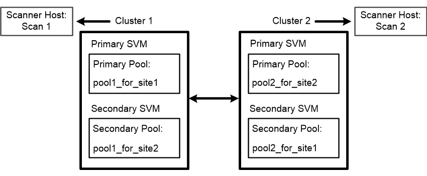

= Créer des pools de scanner dans les configurations MetroCluster
:allow-uri-read: 
:icons: font
:imagesdir: ../media/

[role="lead"]
Il faut créer des pools de scanner primaires et secondaires sur chaque cluster dans une configuration MetroCluster, ce qui correspond aux SVM principal et secondaire sur le cluster.

.Ce dont vous avez besoin, 8217;ll
* Les SVM et les serveurs Vscan doivent se trouver dans le même domaine ou dans des domaines de confiance.
* Pour les scanner pool définis pour un SVM individuel, vous devez avoir configuré le ONTAP antivirus Connector avec la LIF de management SVM ou la LIF de données SVM.
* Pour les scanner pool définis pour tous les SVM d'un cluster, vous devez avoir configuré le ONTAP antivirus Connector avec la LIF cluster management.

Les configurations MetroCluster protègent les données grâce à la mise en œuvre de deux clusters en miroir séparés physiquement. Chaque cluster réplique de manière synchrone les données et la configuration SVM de l'autre. Un SVM principal sur le cluster local diffuse des données lorsque le cluster est en ligne. Un SVM secondaire situé sur le cluster local transmet des données lorsque le cluster distant est hors ligne.

Cela signifie que vous devez créer des pools de scanner principal et secondaire sur chaque cluster dans une configuration MetroCluster correspondant aux SVM principal et secondaire sur le cluster. Le pool secondaire devient actif lorsque le cluster commence à transmettre les données du SVM secondaire. L'illustration suivante montre une configuration MetroCluster typique.

[NOTE]
====
La liste des utilisateurs privilégiés doit inclure le compte d'utilisateur de domaine que le serveur Vscan utilise pour se connecter à la SVM.

====
.Étapes
. Créer un pool de scanner :
+
`vserver vscan scanner-pool create -vserver _data_SVM|cluster_admin_SVM_ -scanner-pool _scanner_pool_ -hostnames _Vscan_server_hostnames_ -privileged-users _privileged_users_`

+
** Spécifier un SVM de données pour un pool défini pour un SVM individuel et spécifier un SVM d'administration du cluster pour un pool défini pour tous les SVM d'un cluster.
** Spécifiez une adresse IP ou un FQDN pour chaque nom d'hôte de serveur Vscan.
** Spécifiez le domaine et le nom d'utilisateur pour chaque utilisateur privilégié.

+
[NOTE]
====
On doit créer tous les scanner pool depuis le cluster contenant le SVM principal.

====
+
Pour obtenir la liste complète des options, consultez la page man de la commande.

+
Les commandes suivantes créent des scanner pool principal et secondaire sur chaque cluster en configuration MetroCluster :

+
[listing]
----
cluster1::> vserver vscan scanner-pool create -vserver cifssvm1 -
scanner-pool pool1_for_site1 -hostnames scan1 -privileged-users cifs
\u1,cifs\u2

cluster1::> vserver vscan scanner-pool create -vserver cifssvm1 -
scanner-pool pool1_for_site2 -hostnames scan1 -privileged-users cifs
\u1,cifs\u2

cluster1::> vserver vscan scanner-pool create -vserver cifssvm1 -
scanner-pool pool2_for_site1 -hostnames scan2 -privileged-users cifs
\u1,cifs\u2

cluster1::> vserver vscan scanner-pool create -vserver cifssvm1 -
scanner-pool pool2_for_site2 -hostnames scan2 -privileged-users cifs
\u1,cifs\u2
----
. Vérifiez que les scanner pool ont été créés : `vserver vscan scanner-pool show -vserver _data_SVM|cluster_admin_SVM_ -scanner-pool _scanner_pool_`
+
Pour obtenir la liste complète des options, consultez la page man de la commande.

+
La commande suivante affiche les détails du scanner pool `pool1`:

+
[listing]
----
cluster1::> vserver vscan scanner-pool show -vserver cifssvm1 -scanner-pool pool1_for_site1

                                    Vserver: cifssvm1
                               Scanner Pool: pool1_for_site1
                             Applied Policy: idle
                             Current Status: off
         Cluster on Which Policy Is Applied: -
                  Scanner Pool Config Owner: vserver
       List of IPs of Allowed Vscan Servers:
List of Host Names of Allowed Vscan Servers: scan1
                   List of Privileged Users: cifs\u1,cifs\u2
----
+
Vous pouvez également utiliser le `vserver vscan scanner-pool show` Commande pour afficher tous les scanner pool d'un SVM. Pour connaître la syntaxe complète de la commande, reportez-vous à la page man.

