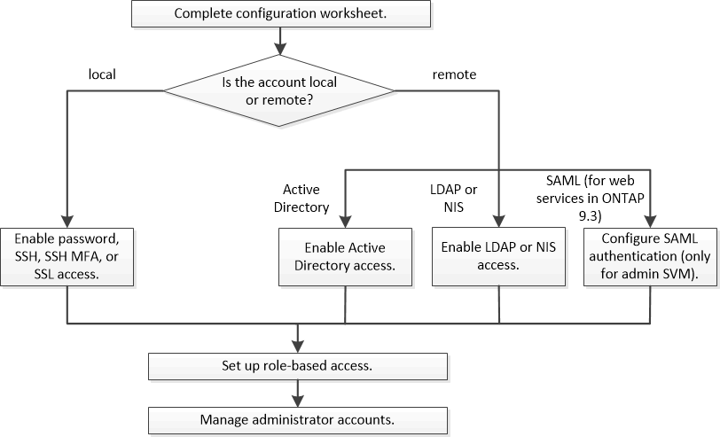

= Authentification de l'administrateur et flux de travail RBAC
:allow-uri-read: 
:icons: font
:imagesdir: ../media/

[role="lead"]
Vous pouvez activer l'authentification pour les comptes d'administrateur local ou les comptes d'administrateur distant. Les informations de compte d'un compte local résident sur le système de stockage et les informations de compte d'un compte distant se trouvent ailleurs. Chaque compte peut avoir un rôle prédéfini ou un rôle personnalisé.

Vous pouvez activer les comptes d'administrateur local pour accéder à une machine virtuelle de stockage (SVM) d'administration ou à un SVM de données avec les types d'authentification suivants :

* Mot de passe
* Clé publique SSH
* Certificat SSL
* Authentification multifacteur SSH (MFA)
+
Depuis ONTAP 9.3, l'authentification avec mot de passe et clé publique est prise en charge.

Vous pouvez activer les comptes d'administrateur distant pour accéder à un SVM d'administration ou à un SVM de données avec les types d'authentification suivants :

* Active Directory
* Authentification SAML (uniquement pour le SVM d'administration)
+
Depuis ONTAP 9.3, l'authentification SAML permet d'accéder à la SVM d'administration à l'aide de l'un des services web suivants : service Processor Infrastructure, ONTAP API ou System Manager.

* Depuis la version ONTAP 9.4, l'authentification SSH MFA peut être utilisée pour les utilisateurs distants sur des serveurs LDAP ou NIS. L'authentification avec nsswitch et la clé publique est prise en charge.

