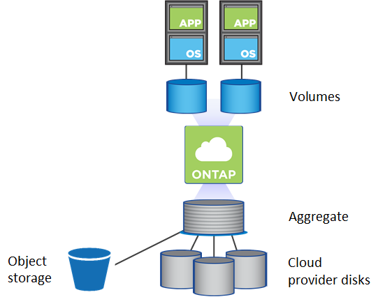

= Gestion des volumes
:allow-uri-read: 
:icons: font
:imagesdir: ../media/

[role="lead"]
La gestion flexible et efficace des volumes est au cœur de la solution cloud de ONTAP. Les volumes ONTAP FlexVol présentent les mêmes avantages que Data Fabric, avec les mêmes processus de gestion des données, qu'ils soient configurés sur site dans le cloud. Les fonctionnalités cloud vous permettent également de faire évoluer rapidement les charges de travail, augmentant ou réduisant la capacité en fonction des besoins.

Les volumes cloud offrent les mêmes fonctionnalités d'efficacité du stockage que les volumes sur site : déduplication, compression, compaction, provisionnement fin et Tiering des données. Dans un environnement cloud, vous payez moins pour l'utilisation des disques sous-jacents.

Il existe deux méthodes de provisionnement des volumes dans le cloud :

* Création de nouveaux volumes cloud.
* Répliquez des volumes sur site existants vers une nouvelle destination de volumes cloud à l'aide de la technologie SnapMirror ou du service Cloud Sync.

.Informations associées
https://["BlueXP : provisionnement du stockage"]

https://["Gestion des volumes pour Azure NetApp Files"]

https://["Gestion d'Cloud Volumes Service pour AWS"]

https://["Service Cloud Sync"]
