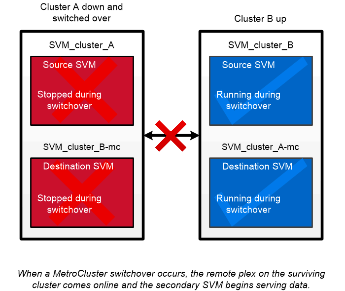

= Disponibilité sans interruption avec MetroCluster
:hardbreaks:
:allow-uri-read: 
:icons: font
:imagesdir: ../media/

[role="lead"]
Les configurations MetroCluster protègent les données grâce à la mise en œuvre de deux clusters en miroir séparés physiquement. Chaque cluster réplique de manière synchrone les données et la configuration SVM de l'autre. En cas d'incident sur un site, un administrateur peut activer la SVM en miroir et commencer à transférer les données depuis le site survivant.

* Les _configurations MetroCluster_ reliées à la structure prennent en charge les clusters à l'échelle de la zone métropolitaine.
* _Stretch MetroCluster_ configurations prennent en charge les clusters à l'échelle du campus.

Les grappes doivent être pételées dans les deux cas.

MetroCluster utilise la fonctionnalité ONTAP appelée _SyncMirror_ pour mettre en miroir de manière synchrone les données d'agrégats pour chaque cluster dans des copies, ou _plex_, dans le stockage de l'autre cluster. En cas de basculement, le plex distant sur le cluster survivant est mis en ligne et le SVM secondaire commence à transmettre les données.

|===

 a| 
*_utilisation de SyncMirror dans des implémentations non MetroCluster_*
Vous pouvez, par ailleurs, utiliser SyncMirror dans une implémentation non MetroCluster pour vous protéger contre la perte de données si le nombre de disques défaillants est supérieur à la protection du type RAID ou en cas de perte de connectivité avec les disques du groupe RAID. La fonctionnalité est disponible uniquement pour les paires haute disponibilité.

Les données agrégées sont mises en miroir dans des plexes stockés sur différents tiroirs disques. Si l'un des tiroirs n'est plus disponible, le plex non affecté continue à transmettre des données pendant que vous corrigez la défaillance.

N'oubliez pas qu'un agrégat en miroir avec SyncMirror nécessite deux fois plus de stockage qu'un agrégat non mis en miroir. Chaque plex requiert autant de disques que le plex IT miroirs. Vous auriez besoin de 2,880 Go d'espace disque, par exemple pour mettre en miroir un agrégat de 1,440 Go, 1,440 Go par plex.

[NOTE]
====
SyncMirror est également disponible pour les implémentations de virtualisation FlexArray.

====
|===