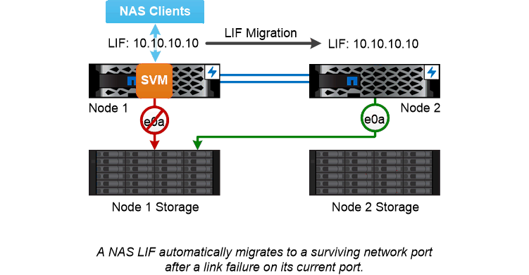

= Basculement de chemin NAS
:allow-uri-read: 
:icons: font
:imagesdir: ../media/

[role="lead"]
Une LIF NAS migre automatiquement vers un port réseau survivant après une panne de liaison sur son port actuel. Le port vers lequel la LIF migre doit être membre de la _failover group_ pour la LIF. La _failover group policy_ permet de rétrécir les cibles de basculement pour une LIF de données vers les ports sur le nœud qui possède les données et son partenaire de haute disponibilité.

Pour des raisons de commodité administrative, ONTAP crée un groupe de basculement pour chaque _broadcast domain_ dans l'architecture réseau. Les domaines de diffusion regroupent des ports appartenant au même réseau de couche 2. Si vous utilisez des VLAN, par exemple, pour isoler le trafic par département (ingénierie, marketing, finance, etc.), chaque VLAN définit un domaine de diffusion distinct. Le groupe de basculement associé au domaine de diffusion est automatiquement mis à jour chaque fois que vous ajoutez ou supprimez un port de broadcast domain.

Il est presque toujours bon d'utiliser un domaine de diffusion pour définir un groupe de basculement pour s'assurer que le groupe de basculement reste à jour. Toutefois, vous pouvez parfois définir un groupe de basculement qui n'est pas associé à un domaine de diffusion. Par exemple, vous pouvez vouloir que les LIFs échouent uniquement en cas de ports d'un sous-ensemble des ports définis dans le broadcast domain.

|===

 a| 
*_sous-réseaux_*

A _subnet_ réserve un bloc d'adresses IP dans un domaine de diffusion. Ces adresses appartiennent au même réseau de couche 3 et sont allouées aux ports du broadcast domain lorsque vous créez une LIF. Il est généralement plus facile et moins sujette aux erreurs pour spécifier un nom de sous-réseau lorsque vous définissez une adresse LIF qu'il ne doit spécifier une adresse IP et un masque réseau.

|===