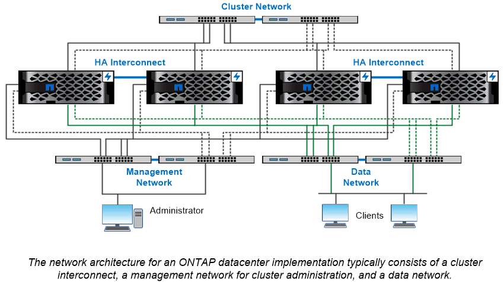

= Présentation de l'architecture réseau
:allow-uri-read: 
:icons: font
:imagesdir: ../media/

[role="lead"]
L'architecture réseau d'une implémentation de data Center ONTAP se compose généralement d'une interconnexion de cluster, d'un réseau de gestion pour l'administration de clusters et d'un réseau de données. Les cartes réseau (cartes d'interface réseau) fournissent des ports physiques pour les connexions Ethernet. Les HBA (adaptateurs de bus hôte) fournissent des ports physiques pour les connexions FC.

