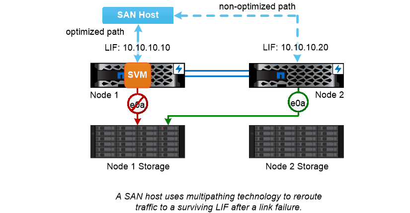

= Basculement de chemin SAN
:allow-uri-read: 
:icons: font
:imagesdir: ../media/

[role="lead"]
Un hôte SAN utilise le protocole ALUA (Asymmetric Logical Unit Access) et MPIO (chemins d'accès E/S multiples) pour rediriger le trafic vers un LIF survivant après une défaillance de liaison. Les chemins prédéfinis déterminent les voies possibles vers la LUN desservie par la SVM.

Dans un environnement SAN, les hôtes sont considérés comme des _initiateurs_ des requêtes vers des LUN _Targets._ MPIO active plusieurs chemins d'accès des initiateurs aux cibles. ALUA identifie les chemins les plus directs, appelés « chemins optimisés »._

Vous configurez généralement plusieurs chemins optimisés vers les LIF sur le nœud propriétaire de la LUN, ainsi que plusieurs chemins non optimisés vers ceux-ci sur son partenaire haute disponibilité. Si un port tombe en panne sur le nœud propriétaire, l'hôte achemine le trafic vers les ports survivants. Si tous les ports échouent, l'hôte achemine le trafic sur les chemins non optimisés.

Par défaut, ONTAP Selective LUN Map (SLM) limite le nombre de chemins d'accès de l'hôte à une LUN. Une LUN nouvellement créée est accessible uniquement via des chemins vers le nœud qui possède la LUN ou son partenaire de haute disponibilité. Vous pouvez également limiter l'accès à une LUN en configurant des LIFs dans un _port set_ pour l'initiateur.

|===

 a| 
*_déplacement de volumes dans des environnements SAN_*

Par défaut, ONTAP _Selective LUN Map (SLM)_ limite le nombre de chemins d'accès à une LUN à partir d'un hôte SAN. Une LUN nouvellement créée n'est accessible qu'via des chemins vers le nœud qui possède la LUN ou son partenaire de haute disponibilité, le _node_ reporting pour la LUN.

En effet, lorsque vous déplacez un volume vers un nœud d'une autre paire haute disponibilité, vous devez ajouter des nœuds de reporting pour la paire haute disponibilité de destination au mappage de LUN. Vous pouvez ensuite spécifier les nouveaux chemins dans la configuration de MPIO. Une fois le déplacement de volume terminé, vous pouvez supprimer des nœuds de reporting de la paire haute disponibilité source du mappage.

|===