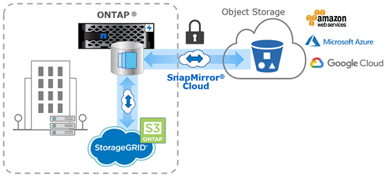

= Sauvegardes SnapMirror dans le cloud sur le stockage objet
:allow-uri-read: 
:icons: font
:imagesdir: ../media/

[role="lead"]
_SnapMirror_ est une technologie de sauvegarde et de restauration conçue pour les utilisateurs ONTAP qui souhaitent migrer leurs workflows de protection des données vers le cloud. Les entreprises qui se détournent de leurs architectures de sauvegarde sur bande existantes peuvent utiliser le stockage objet comme référentiel alternatif pour la conservation et l'archivage des données à long terme. SnapMirror Cloud permet la réplication du stockage ONTAP vers objet dans le cadre d'une stratégie de sauvegarde incrémentielle à l'infini.

SnapMirror Cloud a été introduit dans ONTAP 9.8 en tant qu'extension de la gamme de technologies de réplication SnapMirror. Même si SnapMirror est fréquemment utilisé pour les sauvegardes ONTAP à ONTAP, SnapMirror Cloud utilise le même moteur de réplication pour transférer les copies Snapshot pour ONTAP vers des sauvegardes de stockage objet conformes S3.

Conçu pour les sauvegardes, SnapMirror Cloud prend en charge à la fois les workflows de conservation et d'archivage à long terme. Tout comme SnapMirror, la sauvegarde SnapMirror Cloud initiale effectue un transfert de base d'un volume. Pour les sauvegardes ultérieures, SnapMirror Cloud génère une copie Snapshot du volume source et transfère la copie Snapshot avec uniquement les blocs de données modifiés vers une cible de stockage objet.

Les relations SnapMirror Cloud peuvent être configurées entre des systèmes ONTAP et certaines cibles de stockage objet sur site et dans le cloud public, notamment AWS S3, Google Cloud Storage Platform et Microsoft Azure Blob Storage. StorageGRID et ONTAP S3 figurent parmi les cibles de stockage objet sur site supplémentaires.

La réplication SnapMirror Cloud est une fonctionnalité ONTAP sous licence. Elle requiert une application approuvée pour orchestrer les workflows de protection des données. Plusieurs options d'orchestration sont disponibles pour la gestion des sauvegardes SnapMirror Cloud :

* Plusieurs partenaires de sauvegarde tiers qui prennent en charge la réplication SnapMirror Cloud. Les fournisseurs participants sont disponibles sur le link:https://www.netapp.com/blog/new-backup-architecture-snapdiff-v3/["Blog NetApp"^].
* BlueXP et Cloud Backup pour une solution NetApp native pour les environnements ONTAP
* API pour développer des logiciels personnalisés pour les workflows de protection des données ou exploiter les outils d'automatisation

