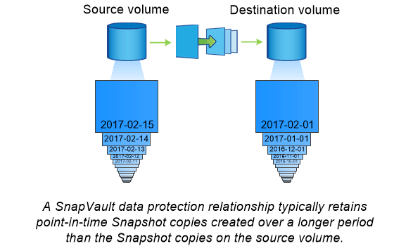

= Archivage SnapVault
:allow-uri-read: 
:icons: font
:imagesdir: ../media/

[role="lead"]
La licence SnapMirror permet la prise en charge des relations SnapVault pour la sauvegarde et des relations SnapMirror pour la reprise sur incident. Les licences SnapVault étaient obsolètes et les licences SnapMirror peuvent maintenant être utilisées pour configurer les relations vault, en miroir et en miroir-copie. La réplication SnapMirror est utilisée pour la réplication ONTAP vers ONTAP des copies Snapshot, et prend en charge à la fois des opérations de sauvegarde et de reprise d'activité.

_SnapVault_ est une technologie d'archivage conçue pour la réplication de copie Snapshot disque à disque à des fins de conformité aux normes et autres pour la gouvernance. Contrairement à une relation SnapMirror, dans laquelle la destination contient généralement uniquement les copies Snapshot actuellement dans le volume source, la destination SnapVault conserve en général les copies Snapshot instantanées créées sur une période bien plus longue.

Vous pouvez conserver tous les mois des copies Snapshot de vos données sur une période de 20 ans, par exemple, pour vous conformer aux réglementations gouvernementales relatives à la comptabilité de votre entreprise. Etant donné qu'il n'est pas nécessaire de transmettre des données à partir du stockage Vault, vous pouvez utiliser des disques plus lents et moins coûteux sur le système de destination.

Tout comme SnapMirror, SnapVault effectue un transfert de base dès la première fois que vous l'appelez. Il effectue une copie Snapshot du volume source, puis transfère la copie et les blocs de données qu'il renvoie vers le volume de destination. Contrairement à SnapMirror, SnapVault n'inclut pas d'anciennes copies Snapshot dans la configuration de base.

Les mises à jour sont asynchrones, en fonction du planning que vous configurez. Les règles que vous définissez dans la règle pour la relation identifient les nouvelles copies Snapshot à inclure dans les mises à jour et le nombre de copies à conserver. Les libellés définis dans la politique (« mensuel », par exemple) doivent correspondre à un ou plusieurs libellés définis dans la politique Snapshot de la source. Dans le cas contraire, la réplication échoue.

[NOTE]
====
SnapMirror et SnapVault partagent la même infrastructure de commandes. Vous spécifiez la méthode à utiliser lors de la création d'une stratégie. Les deux méthodes exigent des clusters de peering et des SVM.

====

