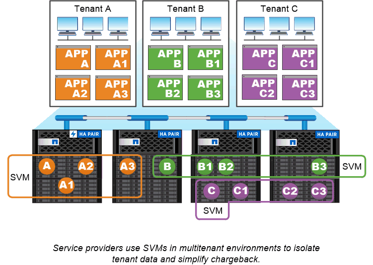

= Cas d'utilisation de SVM
:allow-uri-read: 
:icons: font
:imagesdir: ../media/

[role="lead"]
Les Service Providers utilisent des SVM dans le cadre d'accords de colocation sécurisée afin d'isoler les données de chaque locataire, de fournir à chacun d'eux ses propres fonctionnalités d'authentification et d'administration, et de simplifier la refacturation. Vous pouvez attribuer plusieurs LIF à la même SVM afin de répondre aux différents besoins des clients et utiliser la qualité de service pour vous protéger des charges de travail mutualisées et « brider » les charges de travail des autres locataires.

Les administrateurs utilisent des SVM à des fins similaires dans l'entreprise. Vous pouvez isoler les données de différents départements ou préserver l'accès aux volumes de stockage des hôtes dans un SVM et les volumes de partage d'utilisateurs dans un autre. Certains administrateurs placent les LUN iSCSI/FC et les datastores NFS dans un partage SVM et SMB dans un autre.

