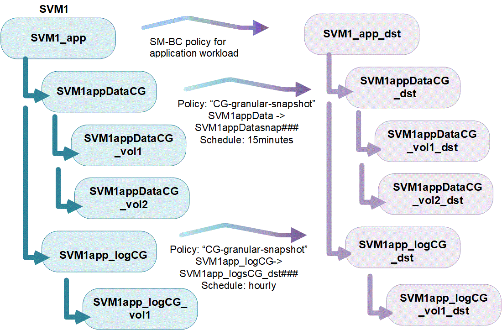

= Présentation des groupes de cohérence
:allow-uri-read: 
:icons: font
:imagesdir: ../media/

[role="lead"]
Un groupe de cohérence est un ensemble de volumes qui assure la cohérence d'écriture d'une charge de travail applicative couvrant plusieurs volumes.

Les groupes de cohérence facilitent la gestion de la charge de travail des applications, ce qui facilite la gestion des règles de protection locales et distantes, mais aussi la création simultanée de copies Snapshot cohérentes au niveau des applications ou des défaillances d'un ensemble de volumes à un moment donné. Les snapshots des groupes de cohérence permettent de restaurer toute une charge de travail applicative.

Les groupes de cohérence prennent en charge n'importe quel volume FlexVol, quel que soit le protocole (NAS, SAN ou NVMe). Ils peuvent être gérés via l'API REST de ONTAP ou dans System Manager, dans l'élément de menu *stockage > groupes de cohérence*.

Des groupes de cohérence peuvent exister en leur propre ou dans une relation hiérarchique. Un groupe de cohérence individuel est une collection de volumes. Les volumes peuvent disposer de leur propre stratégie de snapshots granulaire par volume. De plus, le groupe de cohérence avec lequel le volume est associé peut avoir sa propre politique de snapshot. Le groupe de cohérence ne peut avoir qu'une seule relation SM-BC et une politique SM-BC partagée, qui peuvent être utilisées pour restaurer l'ensemble du groupe de cohérence.

image:../media/consistency-group-single-diagram.gif["Diagramme d'un seul groupe de cohérence avec ses volumes constitutifs et sa règle Snapshot locale"]

Des charges de travail applicatives plus importantes peuvent nécessiter plusieurs groupes de cohérence. Dans ce cas, plusieurs groupes de cohérence peuvent être placés ensemble dans une relation hiérarchique. Dans cette configuration, les groupes de cohérence uniques deviennent les composants enfants d'un groupe de cohérence parent. Le groupe de cohérence parent peut inclure au maximum cinq groupes de cohérence enfant. Comme dans les groupes de cohérence individuels, une stratégie de protection SM-BC distante peut être appliquée à la configuration complète des groupes de cohérence (parents et enfants) pour restaurer la charge de travail de l'application.

Depuis la version ONTAP 9.12.1, les groupes de cohérence sont pris en charge xref:clone-task.html[clonage] et en modifiant les membres de la cohérence par xref:modify-task.html[ajout ou suppression de volumes] Dans System Manager et dans l'API REST de ONTAP. Depuis ONTAP 9.12.1, l'API REST de ONTAP prend également en charge :

* Création d'un groupe de cohérence avec de nouveaux volumes NFS ou SMB ou espaces de noms NVMe.
* Ajout de volumes NFS ou SMB ou d'espaces de noms NVMe nouveaux ou existants à un groupe de cohérence existant.

Pour plus d'informations sur l'API REST de ONTAP, reportez-vous à https://docs.netapp.com/us-en/ontap-automation/reference/api_reference.html#access-a-copy-of-the-ontap-rest-api-reference-documentation["Documentation de référence de l'API REST ONTAP"].

== La protection

Les groupes de cohérence offrent une protection locale via les règles Snapshot et la protection à distance via SnapMirror Business Continuity (SM-BC). La création d'un groupe de cohérence n'active pas automatiquement la protection. Les règles de protection locales et/ou à distance peuvent être définies lors de la création ou après la création d'un groupe de cohérence.

Pour configurer la protection locale avec les groupes de cohérence, reportez-vous à la section link:protect-task.html["Protéger un groupe de cohérence"]. À partir de la ONTAP 9.11.1, les groupes de cohérence proposent link:protect-task.html#two-phase-CG-snapshot-creation["création de copies snapshot de groupe de cohérence en deux phases"].

Pour utiliser la protection à distance, vous devez répondre aux exigences de xref:../smbc/smbc_plan_prerequisites.html#licensing[Déploiements de continuité de l'activité SnapMirror].

NOTE: Les relations SM-BC ne peuvent pas être établies sur les volumes montés pour l'accès NAS.

== Balises d'application et de composant

Depuis ONTAP 9.12.1, les groupes de cohérence prennent en charge le balisage des composants et des applications. Les balises d'application et de composant sont un outil de gestion qui vous permet de filtrer et d'identifier différentes charges de travail dans vos groupes de cohérence.

Les balises d'application s'appliquent aux groupes de cohérence individuel et parent. Les balises d'application fournissent un étiquetage pour les charges de travail telles que MongoDB, Oracle ou SQL Server. La balise d'application par défaut pour les groupes de cohérence est autre. Les enfants des groupes de cohérence hiérarchiques ont des balises de composant au lieu de balises d'application. Les options pour les balises de composant sont « données », « journaux » ou « autre ». La valeur par défaut est autre.

Lorsque vous créez un groupe de cohérence ou après la création d'un groupe de cohérence, vous pouvez appliquer les balises. Si le groupe de cohérence possède une relation SM-BC, vous devez utiliser *Other* comme balise d'application ou de composant.

== Groupes de cohérence dans les configurations MetroCluster

Depuis ONTAP 9.11.1, vous pouvez provisionner les groupes de cohérence avec de nouveaux volumes sur un cluster dans une configuration MetroCluster. Ces volumes sont provisionnés sur des agrégats en miroir.

Une fois ces agrégats provisionnés, vous pouvez déplacer les volumes associés aux groupes de cohérence entre les agrégats en miroir et non mis en miroir. Elles peuvent donc être situées sur des agrégats en miroir, des agrégats sans miroir, ou les deux. Vous pouvez modifier les agrégats en miroir contenant des volumes associés à des groupes de cohérence pour ne plus mettre en miroir. De même, vous pouvez modifier les agrégats non mis en miroir contenant les volumes associés à des groupes de cohérence pour activer la mise en miroir.

Les volumes associés aux groupes de cohérence placés sur des agrégats en miroir et leurs snapshots, y compris les snapshots de groupes de cohérence, sont répliqués sur le site distant (site B). Le contenu des volumes du site B est compatible avec la sémantique du groupe de cohérence. Vous pouvez accéder aux snapshots de groupes de cohérence répliqués via une API REST de groupe de cohérence Snapshot et System Manager sur des clusters exécutant ONTAP 9.11.1 ou une version ultérieure.

Si certains ou la totalité des volumes associés à un groupe de cohérence se trouvent sur des agrégats non mis en miroir qui ne sont pas actuellement accessibles, LES opérations D'OBTENTION ou DE SUPPRESSION du groupe de cohérence se comportent comme si les volumes locaux ou les agrégats d'hébergement sont hors ligne.

=== Réplication de la configuration du groupe de cohérence

Si le site B exécute ONTAP 9.10.1 ou une version antérieure, seuls les volumes associés aux groupes de cohérence situés sur les agrégats en miroir sont répliqués sur le site B. Les configurations de groupes de cohérence sont uniquement répliquées sur le site B, si les deux sites exécutent ONTAP 9.11.1 ou version ultérieure.après la mise à niveau du site B vers ONTAP 9.11.1, les données des groupes de cohérence du site A sur lesquels tous leurs volumes associés sont placés sur des agrégats en miroir sont répliquées vers le site B.

== Mise à niveau

Les groupes de cohérence créés avec SM-BC dans ONTAP 9.8 et 9.9.1 seront automatiquement mis à niveau et gérés sous *stockage > groupes de cohérence* dans System Manager ou l'API REST ONTAP lors de la mise à niveau vers ONTAP 9.10.1. Pour plus d'informations sur la mise à niveau, voir link:../smbc/smbc_admin_upgrade_and_revert_considerations.html["Considérations relatives à la mise à niveau et à la restauration de SM-BC"].

Les snapshots de groupes de cohérence créés avec l'API REST de ONTAP peuvent être gérés via l'interface du groupe de cohérence de System Manager et via les terminaux API de groupe de cohérence.

Snapshots créés avec les commandes ONTAPI `cg-start` et `cg-commit` Ne sera pas reconnu en tant que snapshots de groupe de cohérence et ne peut donc pas être géré via l'interface de groupe de cohérence de System Manager, ni les terminaux de groupe de cohérence de l'API ONTAP.

== Limites d'objets de groupe de cohérence

|===

| Groupes de cohérence | Portée | Minimum | Maximum 

| Nombre de groupes de cohérence | Cluster | 0 | Identique au nombre maximum de volumes dans le cluster 

| Nombre de groupes de cohérence parent | Cluster | 0 | Identique au nombre maximum de volumes dans le cluster 

| Nombre de groupes de cohérence individuels et parents | Cluster | 0 | Identique au nombre maximum de volumes dans le cluster 

| Groupe de cohérence | Identique au nombre maximum de volumes dans le cluster | 1 | 80 

| Nombre de volumes dans l'enfant d'un groupe de cohérence parent | Groupe de cohérence parent | 1 | 80 

| Nombre de volumes dans un groupe de cohérence enfant | Groupe de cohérence enfant | 1 | 80 

| Nombre de groupes de cohérence enfants dans un groupe de cohérence parent | Groupe de cohérence parent | 1 | 5 
|===
Si vous utilisez SM-BC, reportez-vous à link:../smbc/smbc_plan_additional_restrictions_and_limitations.html#volumes["Restrictions et limitations de SM-BC pour les limites"].

== En savoir plus sur les groupes de cohérence

video::j0jfXDcdyzE[youtube,width=848,height=480]