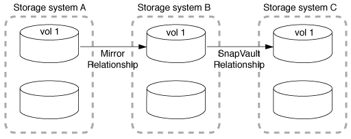

= Déploiements de la protection des données en cascade et « Fan-Out »
:allow-uri-read: 
:icons: font
:imagesdir: ../media/

[role="lead"]
Vous pouvez utiliser un déploiement _Fan-Out_ pour étendre la protection des données à plusieurs systèmes secondaires. Vous pouvez utiliser un déploiement _cascade_ pour étendre la protection des données aux systèmes tertiaires.

Les déploiements « Fan-Out » et « cascade » prennent en charge n'importe quelle combinaison de reprise après incident SnapMirror, d'SnapVault ou de réplication unifiée. Cependant, les relations SnapMirror synchrone (prises en charge à partir de ONTAP 9.5) prennent en charge uniquement les déploiements « Fan-Out » avec une ou plusieurs relations SnapMirror asynchrones, et ne prennent pas en charge les déploiements en cascade. Une seule relation dans la configuration « Fan-Out » peut être une relation SnapMirror synchrone, toutes les autres relations du volume source doivent être des relations SnapMirror asynchrones. xref:../smbc/resume-protection-fan-out-configuration.html[Continuité de l'activité SnapMirror] (Pris en charge depuis ONTAP 9.8) prend également en charge les configurations « Fan-Out ».

NOTE: Vous pouvez utiliser un déploiement _Fan-In_ pour créer des relations de protection des données entre plusieurs systèmes primaires et un seul système secondaire. Chaque relation doit utiliser un volume différent sur le système secondaire.

NOTE: Sachez que les volumes faisant partie d'une configuration en cascade ou en « Fan-Out » peuvent prendre plus de temps
resynchroniser. Il n'est pas rare d'avoir accès aux rapports de relation SnapMirror
l'état « préparation » pour une période prolongée.

== Fonctionnement des déploiements « Fan-Out »

SnapMirror prend en charge les déploiements _plusieurs-miroirs_ et _mirror-vault_ Fan-Out.

Un déploiement à plusieurs miroirs multiples sur « Fan-Out » comprend un volume source possédant une relation de mise en miroir sur plusieurs volumes secondaires.

image::../media/sm-mirror-mirror-fanout.png[Déploiement de la protection des données : mise en miroir multi-miroirs]

Le déploiement de « fan-out » en miroir-coffre-fort consiste en un volume source avec une relation de miroir vers un volume secondaire et une relation SnapVault vers un autre volume secondaire.

image::../media/sm-mirror-vault-fanout.png[Déploiement de la protection des données : mise en attente du miroir]

Depuis ONTAP 9.5, vous pouvez avoir déployé « Fan-Out » avec des relations SnapMirror synchrone. Cependant, seule une relation de la configuration « Fan-Out » peut être une relation SnapMirror synchrone, toutes les autres relations du volume source doivent être des relations SnapMirror asynchrones.

image::../media/ssm-fanout.gif[Déploiement de la protection des données : déploiements « Fan-Out » avec les relations SnapMirror synchrone]

== Fonctionnement des déploiements en cascade

SnapMirror prend en charge les déploiements _mirror-mirror_, _mirror-vault_, _vault-mirror_ et _vault-vault_ cascade.

Le déploiement en cascade de mise en miroir consiste en une chaîne de relations dans laquelle un volume source est mis en miroir sur un volume secondaire, et le volume secondaire est mis en miroir sur un volume tertiaire. Si le volume secondaire n'est plus disponible, vous pouvez synchroniser la relation entre les volumes primaire et tertiaire sans effectuer de nouveau transfert de base.

Depuis ONTAP 9.6, les relations SnapMirror synchrone sont prises en charge dans un déploiement en cascade en miroir. Seuls les volumes primaires et secondaires peuvent être dans une relation SnapMirror synchrone. La relation entre les volumes secondaires et les volumes tertiaires doit être asynchrone.

image::../media/sm-mirror-mirror-cascade.png[Déploiement SnapMirror : source pour mettre en miroir une chaîne en cascade]

Le déploiement de la mise en miroir à distance en cascade consiste en une chaîne de relations dans laquelle le volume source est mis en miroir sur un volume secondaire, et le volume secondaire est copié sur un volume tertiaire.

Les déploiements vault-mirror et, depuis ONTAP 9.2, vault-vault-vault en cascade sont également pris en charge :

* Le déploiement de la mise en miroir en cascade de l'espace de stockage comprend une chaîne de relations dans laquelle le volume source est copié sur un volume secondaire et le volume secondaire est mis en miroir sur un volume tertiaire.
* (Depuis ONTAP 9.2), Le déploiement de coffre-fort en cascade consiste en une chaîne de relations dans laquelle un volume source est copié sur un volume secondaire, et le volume secondaire est copié sur un volume tertiaire.

.Plus de lecture
* xref:../smbc/resume-protection-fan-out-configuration.html[Reprendre la protection dans une configuration de « Fan-Out » avec SM-BC ]

