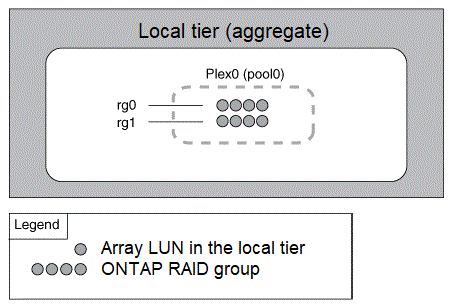

= Niveaux locaux en miroir et sans mise en miroir (agrégats)
:allow-uri-read: 
:icons: font
:imagesdir: ../media/

[role="lead"]
ONTAP dispose d'une fonction optionnelle appelée _SyncMirror_ que vous pouvez utiliser pour mettre en miroir les données de niveau local (agrégat) de manière synchrone dans des copies, ou _plex_, stockées dans différents groupes RAID. Les plexes permettent d'éviter les pertes de données en cas de panne de l'ensemble des disques de type RAID, ou en cas de perte de connectivité aux disques du groupe RAID.

Lorsque vous créez un niveau local avec System Manager ou depuis l'interface de ligne de commandes, vous pouvez spécifier que le niveau local est mis en miroir ou non.

== Fonctionnement des niveaux locaux non mis en miroir (agrégats)

Si vous ne spécifiez pas que les niveaux locaux sont mis en miroir, ils sont créés en tant que niveaux locaux non mis en miroir (agrégats). Les niveaux locaux non mis en miroir ne possèdent qu'un seul _plex_ (une copie de leurs données), qui contient tous les groupes RAID appartenant à ce niveau local.

Le schéma suivant montre un niveau local non mis en miroir composé de disques, avec son plex unique. Le niveau local a quatre groupes RAID : rg0, rg1, rg2 et rg3. Chaque groupe RAID comporte six disques de données, un disque de parité et un disque de parité (double parité). Tous les disques utilisés par le niveau local proviennent du même pool, ""pool0"".

image::../media/drw-plexum-scrn-en-noscale.gif[Le schéma est décrit par le texte précédent.]

Le schéma suivant présente un niveau local non mis en miroir avec des LUN de matrice, avec son plex unique. Il dispose de deux groupes RAID, rg0 et rg1. Toutes les LUN de baie utilisées par le niveau local proviennent du même pool, « pool0 ».

== Fonctionnement des niveaux locaux en miroir (agrégats)

Les agrégats en miroir possèdent deux plexes_ (copies de leurs données), qui exploitent la fonctionnalité SyncMirror pour dupliquer les données pour assurer la redondance.

Lorsque vous créez un niveau local, vous pouvez spécifier qu'il s'agit d'un niveau local mis en miroir. En outre, vous pouvez ajouter un second plex à un niveau local non mis en miroir existant pour en faire un niveau en miroir. Grâce à la fonctionnalité SyncMirror, ONTAP copie les données du plex d'origine (plex0) sur le nouveau plex (plex1). Les plexes sont séparés physiquement (chaque plex dispose de ses propres groupes RAID et de son propre pool), et les plex sont mis à jour simultanément.

Cette configuration renforce la protection contre la perte de données en cas de défaillance de plus de disques que le niveau RAID de l'agrégat assure la protection contre ou en cas de perte de connectivité, car le plex non affecté continue de transmettre les données pendant que vous corrigez la cause de la défaillance. Une fois le plex qui avait un problème résolu, les deux plexes se synchronisaient et rétablissent la relation du miroir.

Les disques et les unités logiques de baie du système sont répartis en deux pools : « pool0 » et « pool1 ». Plex0 obtient son stockage de pool0 et plex1 obtient son stockage de pool1.

Le schéma suivant présente un niveau local composé de disques pour que la fonctionnalité SyncMirror soit activée et implémentée. Un second plex a été créé pour le niveau local, « plex1 ». Les données dans le plex1 sont une copie des données dans le plex0 et les groupes RAID sont également identiques. Les 32 disques de réserve sont alloués à pool0 ou pool1 en utilisant 16 disques par pool.

image::../media/drw-plexm-scrn-en-noscale.gif[Le schéma est décrit par le texte précédent.]

Le schéma suivant présente un niveau local composé de LUN de baie dont la fonctionnalité SyncMirror est activée et implémentée. Un second plex a été créé pour le niveau local, « plex1 ». Plex1 est une copie de plex0 et les groupes RAID sont également identiques.

image::../media/mirrored-aggregate-with-array-luns.gif[Ce diagramme est décrit par le texte précédent.]
