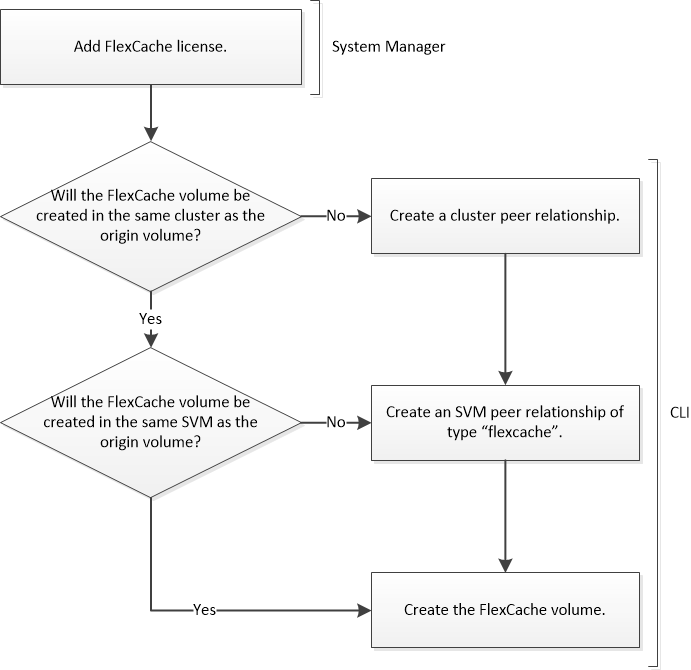

= Workflow de création de volumes FlexCache
:allow-uri-read: 
:icons: font
:imagesdir: ../media/

[role="lead"]
Vous devez d'abord installer la licence FlexCache depuis System Manager. Vous pouvez ensuite créer un volume FlexCache dans le même cluster ou dans un cluster distant en utilisant l'interface de ligne de commande.

Vous devez exécuter ONTAP 9.5 ou version ultérieure.

Vous pouvez utiliser des volumes FlexCache sur le même cluster pour accélérer les performances lors de l'accès aux volumes fortement sollicités. Vous pouvez utiliser les volumes FlexCache dans différents clusters pour améliorer les performances de la distribution des données entre les clusters.
