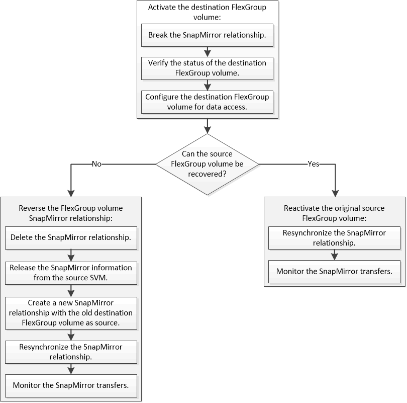

= Workflow de reprise d'activité pour les volumes FlexGroup
:allow-uri-read: 
:icons: font
:imagesdir: ../media/

[role="lead"]
Lorsqu'un incident survient sur le volume FlexGroup source, vous devez activer le volume FlexGroup de destination et rediriger l'accès client. Selon que le volume FlexGroup source peut être restauré ou non, il est recommandé de réactiver le volume FlexGroup source ou d'inverser la relation SnapMirror.

L'accès client au volume FlexGroup de destination est bloqué pendant une courte période lors de l'exécution de certaines opérations SnapMirror, telles que l'arrêt et la resynchronisation de SnapMirror. En cas d'échec de l'opération SnapMirror, il est possible que certains composants restent dans cet état et que l'accès au volume FlexGroup soit refusé. Dans ce cas, vous devez refaire l'opération SnapMirror.
