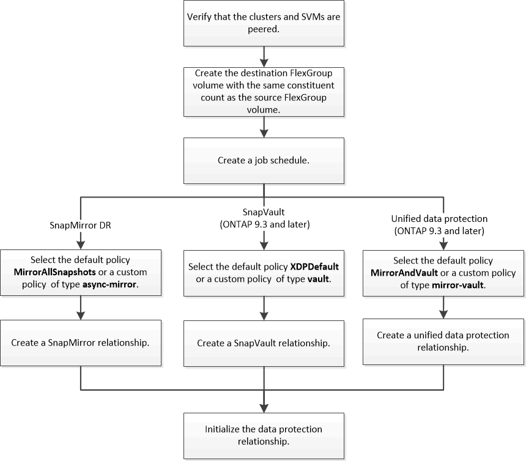

= Workflow de protection des données pour les volumes FlexGroup
:allow-uri-read: 
:icons: font
:imagesdir: ../media/

[role="lead"]
Vous pouvez créer des relations SnapMirror de reprise après incident pour les volumes FlexGroup. Depuis ONTAP 9.3, vous pouvez aussi sauvegarder et restaurer des volumes FlexGroup à l'aide de la technologie SnapVault. De plus, vous pouvez créer une relation unifiée de protection des données qui utilise le même destination pour la sauvegarde et la reprise après incident.

Le workflow de protection des données consiste à vérifier les relations entre le cluster et le SVM peer, à créer un volume de destination, à créer une planification des tâches, à spécifier une politique, à créer une relation de protection des données et à initialiser la relation.

Le type de relation SnapMirror est toujours `XDP` Pour les volumes FlexGroup. Le type de protection des données fourni par une relation SnapMirror est déterminé par la règle de réplication que vous utilisez. Vous pouvez utiliser la règle par défaut ou une règle personnalisée du type requis pour la relation de réplication que vous souhaitez créer. Le tableau ci-dessous présente les types de règles par défaut et les types de règles personnalisées pris en charge pour différents types de relations de protection des données.

|===

| Type de relation | Stratégie par défaut | Type de règle personnalisée 

 a| 
Reprise sur incident SnapMirror
 a| 
MirrorAllsnapshots
 a| 
mise en miroir asynchrone

 a| 
Sauvegarde SnapVault
 a| 
XDPDefault
 a| 
coffre-fort

 a| 
Protection unifiée des données
 a| 
MirrorAndVault
 a| 
coffre-fort

|===
La stratégie MirrorLeste n'est pas prise en charge avec les volumes FlexGroup.
