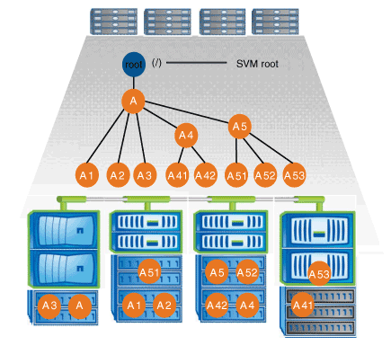

= Caractéristiques des architectures d'espace de noms NAS
:allow-uri-read: 
:icons: font
:imagesdir: ../media/

[role="lead"]
Plusieurs architectures d'espace de noms NAS classiques peuvent être utilisées lors de la création d'un espace de noms de SVM. Vous pouvez choisir l'architecture d'espace de noms qui correspond le mieux à vos besoins métiers et de flux de travail.

Le haut du namespace est toujours le volume root, représenté par une barre oblique (/). L'architecture d'espace de noms sous la racine se divise en trois catégories de base :

* Arbre branché unique, avec une seule jonction à la racine de l'espace de noms
* Plusieurs arborescences ramifiées, avec plusieurs points de jonction à la racine de l'espace de noms
* Plusieurs volumes autonomes, chacun avec un point de jonction séparé à la racine de l'espace de noms

== Espace de noms avec une seule arborescence ramifiée

Une architecture avec une seule arborescence de branche possède un point d'insertion unique à la racine du namespace du SVM. Le point d'insertion unique peut être un volume relié par jonction ou un répertoire sous la racine. Tous les autres volumes sont montés aux points de jonction sous le point d'insertion unique (qui peut être un volume ou un répertoire).

Par exemple, une configuration de jonction de volume typique avec l'architecture de namespace ci-dessus peut ressembler à la configuration suivante, où tous les volumes sont reliés sous le point d'insertion unique, qui est un répertoire nommé « `data' » :

[listing]
----

                     Junction                       Junction
Vserver Volume       Active   Junction Path         Path Source
------- ------------ -------- -------------------   -----------
vs1     corp1        true     /data/dir1/corp1      RW_volume
vs1     corp2        true     /data/dir1/corp2      RW_volume
vs1     data1        true     /data/data1           RW_volume
vs1     eng1         true     /data/data1/eng1      RW_volume
vs1     eng2         true     /data/data1/eng2      RW_volume
vs1     sales        true     /data/data1/sales     RW_volume
vs1     vol1         true     /data/vol1            RW_volume
vs1     vol2         true     /data/vol2            RW_volume
vs1     vol3         true     /data/vol3            RW_volume
vs1     vs1_root     -        /                     -
----

== Espace de noms avec plusieurs arborescences ramifiées

Une architecture avec plusieurs arbres ramifiés a plusieurs points d'insertion à la racine du namespace du SVM. Les points d'insertion peuvent être des volumes ou des répertoires sous la racine. Tous les autres volumes sont montés aux points de jonction sous les points d'insertion (qui peuvent être des volumes ou des répertoires).

image::../media/namespace-architecture-with-multiple-branched-trees.png[Espace de noms avec plusieurs arborescences ramifiées]

Par exemple, une configuration de jonction de volume standard avec l'architecture de namespace ci-dessus peut ressembler à la configuration suivante, où il existe trois points d'insertion pour le volume racine de la SVM. Deux points d'insertion sont des répertoires nommés "data" et "projets". Un point d'insertion est un volume relié par jonction nommé « audit » :

[listing]
----

                     Junction                       Junction
Vserver Volume       Active   Junction Path         Path Source
------- ------------ -------- -------------------   -----------
vs1     audit        true     /audit                RW_volume
vs1     audit_logs1  true     /audit/logs1          RW_volume
vs1     audit_logs2  true     /audit/logs2          RW_volume
vs1     audit_logs3  true     /audit/logs3          RW_volume
vs1     eng          true     /data/eng             RW_volume
vs1     mktg1        true     /data/mktg1           RW_volume
vs1     mktg2        true     /data/mktg2           RW_volume
vs1     project1     true     /projects/project1    RW_volume
vs1     project2     true     /projects/project2    RW_volume
vs1     vs1_root     -        /                     -
----

== Espace de noms avec plusieurs volumes autonomes

Dans une architecture avec des volumes autonomes, chaque volume a un point d'insertion à la racine de l'espace de noms SVM ; cependant, le volume n'est pas relié par jonction sous un autre volume. Chaque volume a un chemin unique, avec une jonction directe sous la racine ou sous un répertoire sous la racine.

image::../media/namespace-architecture-with-multiple-standalone-volumes.gif[Espace de noms avec plusieurs volumes autonomes]

Par exemple, une configuration de jonction de volume standard avec l'architecture de l'espace de noms ci-dessus peut ressembler à la configuration suivante, où il existe cinq points d'insertion pour le volume racine de la SVM, avec chaque point d'insertion représentant un chemin vers un volume.

[listing]
----

                     Junction                       Junction
Vserver Volume       Active   Junction Path         Path Source
------- ------------ -------- -------------------   -----------
vs1     eng          true     /eng                  RW_volume
vs1     mktg         true     /vol/mktg             RW_volume
vs1     project1     true     /project1             RW_volume
vs1     project2     true     /project2             RW_volume
vs1     sales        true     /sales                RW_volume
vs1     vs1_root     -        /                     -
----