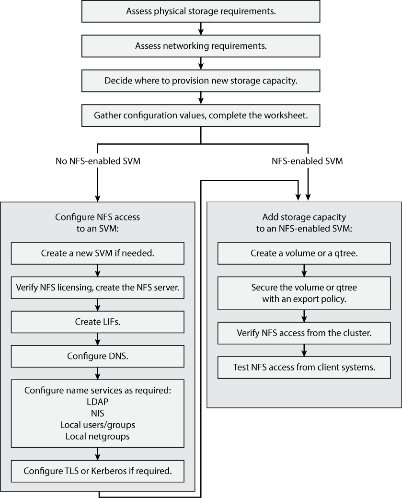

= Workflow de configuration NFS
:allow-uri-read: 
:icons: font
:imagesdir: ../media/

[role="lead"]
La configuration de NFS implique l'évaluation des besoins en stockage physique et en réseau, puis le choix d'un workflow spécifique à votre objectif : configurer l'accès NFS à un SVM nouveau ou existant, ou ajouter un volume ou un qtree à un SVM existant déjà entièrement configuré pour l'accès NFS.

