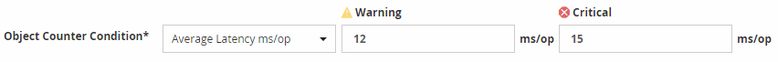

= Définissez des seuils de performances
:allow-uri-read: 
:icons: font
:imagesdir: ../media/

[role="lead"]
Vous pouvez définir des seuils de performance pour contrôler les problèmes de performance stratégiques. Des seuils définis par l'utilisateur déclenchent une notification d'avertissement ou d'événement critique lorsque le système approche ou dépasse le seuil défini.

.Étapes
. Créez les seuils d'avertissement et d'événement critique :
+
.. Sélectionnez *Configuration* > *seuils de performances*.
.. Cliquez sur *Créer*.
.. Sélectionnez le type d'objet et spécifiez un nom et une description de la règle.
.. Sélectionnez la condition de compteur d'objets et spécifiez les valeurs limites qui définissent les événements Avertissement et critique.
.. Sélectionnez la durée pendant laquelle les valeurs limites doivent être enfreintes pour un événement à envoyer, puis cliquez sur *Enregistrer*.

. Attribuez la politique de seuil à l'objet de stockage.
+
.. Accédez à la page Inventaire pour le même type d'objet de cluster que vous avez précédemment sélectionné et choisissez *Performance* dans l'option Afficher.
.. Sélectionnez l'objet auquel vous souhaitez affecter la stratégie de seuil, puis cliquez sur *affecter stratégie de seuil*.
.. Sélectionnez la stratégie que vous avez créée précédemment, puis cliquez sur *affecter stratégie*.

Vous pouvez définir des seuils définis par l'utilisateur pour en savoir plus sur les problèmes de performance stratégiques. Par exemple, si vous disposez d'un serveur Microsoft Exchange et que vous savez qu'il tombe en panne si la latence du volume dépasse 20 millisecondes, vous pouvez définir un seuil d'avertissement à 12 millisecondes et un seuil critique à 15 millisecondes. Avec ce paramètre de seuil, vous pouvez recevoir des notifications lorsque la latence du volume dépasse la limite.

