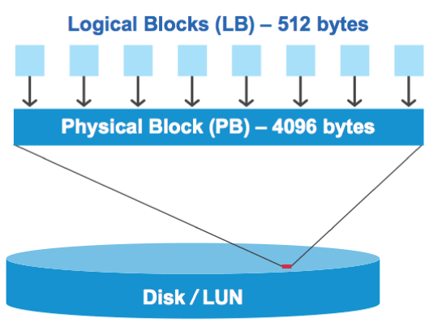

= Aperçu des défauts d'alignement des E/S sur les LUN correctement alignées
:allow-uri-read: 
:icons: font
:imagesdir: ../media/

[role="lead"]
ONTAP peut signaler des problèmes d'alignement des E/S sur les LUN correctement alignées. En général, ces avertissements relatifs au mauvais alignement peuvent être ignorés tant que vous êtes sûr que votre LUN est correctement provisionnée et que votre table de partitionnement est correcte.

Les LUN et les disques durs fournissent tous deux un stockage sous forme de blocs. Étant donné que la taille de bloc des disques de l'hôte est de 512 octets, les LUN présentent des blocs de cette taille à l'hôte tout en utilisant des blocs de 4 Ko plus volumineux pour stocker les données. Le bloc de données de 512 octets utilisé par l'hôte est appelé bloc logique. Le bloc de données de 4 Ko utilisé par le LUN pour stocker les données est appelé bloc physique. Cela signifie qu'il y a huit blocs logiques de 512 octets dans chaque bloc physique de 4 Ko.

Le système d'exploitation hôte peut lancer une opération de lecture ou d'écriture d'E/S sur n'importe quel bloc logique. Les opérations d'E/S n'sont considérées comme alignées que lorsqu'elles commencent au premier bloc logique du bloc physique. Si une opération d'E/S commence au démarrage d'un bloc logique qui n'est pas toujours le début d'un bloc physique, les E/S sont considérées comme mal alignées. ONTAP détecte automatiquement l'alignement incorrect et le signale sur le LUN. Toutefois, l'alignement incorrect des E/S n'entraîne pas nécessairement l'alignement incorrect de la LUN. Il est possible de signalement des E/S mal alignées sur les LUN correctement alignées.

Si vous avez besoin d'une enquête plus approfondie, consultez l'article de la base de connaissances link:https://kb.netapp.com/Advice_and_Troubleshooting/Data_Storage_Software/ONTAP_OS/How_to_identify_unaligned_IO_on_LUNs["Comment identifier les E/S non alignées sur les LUN ?"^]

Pour plus d'informations sur les outils de correction des problèmes d'alignement, reportez-vous à la documentation suivante : +

* https://docs.netapp.com/us-en/ontap-sanhost/hu_wuhu_71.html["Utilitaires d'hôtes unifiés Windows 7.1"]
* https://docs.netapp.com/ontap-9/topic/com.netapp.doc.exp-iscsi-esx-cpg/GUID-7428BD24-A5B4-458D-BD93-2F3ACD72CBBB.html["Guide d'installation et d'administration de Virtual Storage Console pour VMware vSphere"^]

== Assurez l'alignement des E/S à l'aide des types de systèmes d'exploitation LUN

Pour ONTAP 9.7 ou version antérieure, vous devez utiliser le LUN ONTAP recommandé `ostype` Valeur qui correspond le mieux à votre système d'exploitation pour aligner les E/S avec le schéma de partitionnement du système d'exploitation.

Le schéma de partition utilisé par le système d'exploitation hôte constitue un facteur important de désalignement des E/S. Une LUN ONTAP `ostype` les valeurs utilisent un décalage spécial appelé « préfixe » pour permettre l'alignement du schéma de partitionnement par défaut utilisé par le système d'exploitation hôte.

NOTE: Dans certains cas, une table de partitionnement personnalisée peut être nécessaire pour atteindre l'alignement E/S. Cependant, pour `ostype` valeurs dont la valeur « préfixe » est supérieure à `0`, Une partition personnalisée peut créer des E/S mal alignées

Pour plus d'informations sur les LUN provisionnées dans ONTAP 9.7 ou une version antérieure, consultez l'article de la base de connaissances link:https://kb.netapp.com/onprem/ontap/da/SAN/How_to_identify_unaligned_IO_on_LUNs["Comment identifier les E/S non alignées sur les LUN"^].

NOTE: Par défaut, les nouvelles LUN provisionnées dans ONTAP 9.8 ou version ultérieure ont un préfixe et un suffixe de taille zéro pour tous les types de LUN OS. Par défaut, les E/S doivent être alignées sur le système d'exploitation hôte pris en charge.

== Considérations spéciales d'alignement des E/S pour Linux

Les distributions Linux offrent de nombreuses façons d'utiliser un LUN, notamment en tant que périphériques bruts pour bases de données, divers gestionnaires de volumes et systèmes de fichiers. Il n'est pas nécessaire de créer des partitions sur un LUN lorsqu'il est utilisé en tant que périphérique brut ou en tant que volume physique dans un volume logique.

Pour RHEL 5 et versions antérieures et SLES 10 et versions antérieures, si le LUN doit être utilisé sans gestionnaire de volumes, vous devez partitionner le LUN pour avoir une partition qui commence à un décalage aligné, ce qui est un secteur qui est un multiple de huit blocs logiques.

== Considérations spéciales relatives à l'alignement des E/S pour les LUN Solaris

Vous devez tenir compte de divers facteurs pour déterminer si vous devez utiliser le `solaris` otapez ou le `solaris_efi` ostype.

Voir la http://mysupport.netapp.com/documentation/productlibrary/index.html?productID=61343["Solaris Host Utilities - Guide d'installation et d'administration"^] pour des informations détaillées.

== Les LUN de démarrage ESX indiquent un mauvais alignement

Les LUN utilisées comme LUN de démarrage ESX sont généralement signalées par ONTAP comme étant mal alignées. ESX crée plusieurs partitions sur la LUN de démarrage, ce qui complique particulièrement l'alignement. Les LUN de démarrage ESX mal alignées ne sont généralement pas problématiques de performances, car la quantité totale d'E/S mal alignées est faible. Supposant que la LUN ait été correctement provisionnée avec VMware `ostype`, aucune action n'est nécessaire.

.Informations associées
https://kb.netapp.com/Advice_and_Troubleshooting/Data_Storage_Software/Virtual_Storage_Console_for_VMware_vSphere/Guest_VM_file_system_partition%2F%2Fdisk_alignment_for_VMware_vSphere["Alignement des partitions/disques du système de fichiers des machines virtuelles invité pour VMware vSphere, les autres environnements virtuels et les systèmes de stockage NetApp"^]
