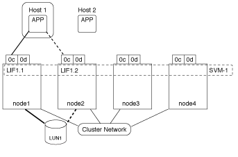

= Fonctionnement de l'accès aux LUN dans un environnement virtualisé
:allow-uri-read: 
:icons: font
:imagesdir: ../media/

[role="lead"]
Dans un environnement virtualisé, les LIF permettent aux hôtes (clients) d'accéder aux LUN via des chemins optimisés et non optimisés.

Une LIF est une interface logique qui connecte le SVM à un port physique. Bien que plusieurs SVM puissent avoir plusieurs LIF sur le même port, une LIF appartient à un SVM. Vous pouvez accéder aux LUN via les LIFs du SVM.

Dans l'exemple suivant, l'hôte 1 se connecte à LIF1.1 et LIF1.2 au SVM-1 pour accéder à LUN1. LIF1.1 utilise le port physique node1:0C et LIF1.2 utilise le node2:0C. LIF1.1 et LIF1.2 n'appartient qu'au SVM-1. Si une nouvelle LUN est créée sur le nœud 1 ou 2, pour SVM-1, elle peut utiliser ces mêmes LIF. Si un nouveau SVM est créé, de nouvelles LIF peuvent être créées à l'aide des ports physiques 0C ou 0d sur les deux nœuds.

Un port physique peut prendre en charge plusieurs LIF servant différents SVM. Étant donné que les LIFs sont associées à un SVM particulier, les nœuds de cluster peuvent envoyer le trafic de données entrantes au SVM correct. Dans l'exemple suivant, chaque nœud de 1 à 4 a une LIF pour SVM-2 en utilisant le port physique 0C sur chaque nœud. L'hôte 1 se connecte à LIF1.1 et LIF1.2 du SVM-1 pour accéder à l'utilitaire LUN1. L'hôte 2 se connecte à LIF2-1 et LIF2-2 au SVM-2 pour accéder à LUN2. Les deux SVM partagent le port physique 0C sur les nœuds 1 et 2. SVM-2 dispose de LIF supplémentaires qui utilisent l'hôte 2 pour accéder aux LUN 3 et 4. Ces LIF utilisent le port physique 0C sur les nœuds 3 et 4. Plusieurs SVM peuvent partager les ports physiques sur les nœuds.

image::../media/bsag-c-mode-multiple-lifs-vservers.gif[2 LIF sur le nœud2 pour 2 vServers]

Dans un chemin actif ou optimisé, le trafic de données ne transite pas par le réseau de clusters ; il déplace le chemin le plus direct vers la LUN. Le chemin actif ou optimisé vers LUN1 est via LIF1.1 dans le nœud1, en utilisant le port physique 0C. L'hôte 2 possède deux chemins actifs ou optimisés, un chemin vers le nœud1, LIF2.1, qui partage le port physique 0C et l'autre chemin vers le nœud4, LIF2.4, qui utilise le port physique 0C.

image::../media/bsag-c-mode-unoptimized-path.gif[exemple de chemin optimisé]

Dans un chemin actif ou non optimisé (indirect), le trafic de données transite par le réseau en cluster. Ce problème survient uniquement si tous les chemins actifs ou optimisés d'un hôte ne sont pas disponibles pour gérer le trafic. Si le chemin d'accès de l'hôte 2 vers SVM-2 LIF2.4 est perdu, l'accès à LUN3 et LUN4 traverse le réseau de cluster. L'accès à partir de l'hôte 2 utilise LIF2.3 sur le noeud 3. Ensuite, le trafic entre dans le commutateur de réseau du cluster et sauvegarde vers le nœud4 pour accéder aux LUN3 et LUN4. Il traverse ensuite le commutateur réseau du cluster, puis revient via LIF2.3 à l'hôte 2. Ce chemin actif ou non optimisé est utilisé jusqu'à ce que le chemin vers LIF2.4 soit restauré ou qu'une nouvelle LIF soit créée pour SVM-2 sur un autre port physique du nœud 4.

image::../media/bsag-c-mode-optimized-path.gif[exemple de chemins non optimisés]
