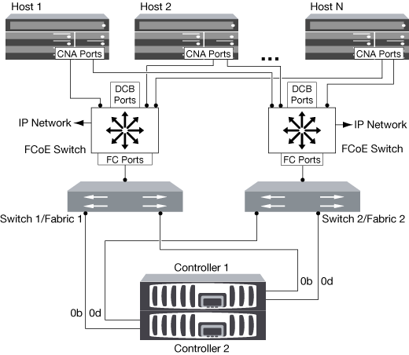
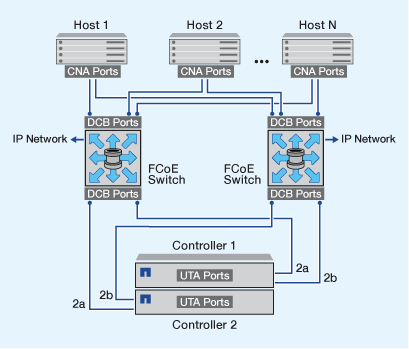

= Présentation des manières de configurer FCoE
:allow-uri-read: 
:icons: font
:imagesdir: ../media/

[role="lead"]
FCoE peut être configuré de différentes manières avec les commutateurs FCoE. Les configurations à connexion directe ne sont pas prises en charge par la FCoE.

Toutes les configurations FCoE sont à double structure, entièrement redondantes et requièrent un logiciel de chemins d'accès multiples côté hôte. Dans toutes les configurations FCoE, vous pouvez avoir plusieurs commutateurs FCoE et FC dans le chemin entre l'initiateur et la cible, dans la limite maximale du nombre de sauts. Pour connecter les commutateurs les uns aux autres, les commutateurs doivent exécuter une version de firmware qui prend en charge les liens ISL Ethernet. Dans toutes les configurations FCoE, chaque hôte peut être configuré avec un système d'exploitation différent.

Les configurations FCoE requièrent des commutateurs Ethernet qui prennent explicitement en charge les fonctionnalités FCoE. Les configurations FCoE sont validées par le biais du même processus d'interopérabilité et d'assurance qualité que les commutateurs FC. Les configurations prises en charge sont répertoriées dans la matrice d'interopérabilité. Certains paramètres inclus dans ces configurations prises en charge sont le modèle de commutateur, le nombre de commutateurs pouvant être déployés dans une structure unique et la version de micrologiciel du commutateur prise en charge.

Les numéros de ports des adaptateurs d'extension FC target de l'illustration sont à titre d'exemples. Les numéros réels des ports peuvent varier en fonction des connecteurs d'extension dans lesquels les adaptateurs d'extension de la cible FCoE sont installés.

== Initiateur FCoE sur la cible FC

En utilisant les initiateurs FCoE (CNA), vous pouvez connecter des hôtes aux deux contrôleurs d'une paire haute disponibilité via des commutateurs FCoE vers les ports cible FC. Le commutateur FCoE doit également posséder des ports FC. L'initiateur FCoE hôte se connecte toujours au commutateur FCoE. Le commutateur FCoE peut se connecter directement à la cible FC ou se connecter à la cible FC via des commutateurs FC.

L'illustration suivante montre les CNA hôtes connectés à un commutateur FCoE, puis à un commutateur FC avant de se connecter à la paire haute disponibilité :

== Initiateur FCoE vers la cible FCoE

En utilisant les initiateurs FCoE hôtes (CNA), vous pouvez connecter les hôtes aux deux contrôleurs d'une paire haute disponibilité aux ports cibles FCoE (également appelés UTAS ou UTA2) à l'aide des commutateurs FCoE.

== Initiateur FCoE sur les cibles FCoE et FC

En utilisant les initiateurs FCoE hôtes (CNA), vous pouvez connecter les hôtes aux deux contrôleurs d'une paire haute disponibilité aux ports cibles FCoE et FC (également appelés UTA ou UTA2) à l'aide des commutateurs FCoE.

image::../media/scrn_en_drw_fcoe-mixed.png[méthode mixte fcoe avec méthode scrum]

== FCoE combiné avec les protocoles de stockage IP

En utilisant les initiateurs FCoE hôtes (CNA), vous pouvez connecter les hôtes aux deux contrôleurs d'une paire haute disponibilité aux ports cibles FCoE (également appelés UTAS ou UTA2) à l'aide des commutateurs FCoE. Les ports FCoE ne peuvent pas utiliser l'agrégation de liens traditionnelle vers un commutateur unique. Les commutateurs Cisco prennent en charge un type spécial d'agrégation de liens (Virtual Port Channel) qui prend en charge le protocole FCoE. Un canal de port virtuel rassemble des liaisons individuelles vers deux commutateurs. Vous pouvez également utiliser les canaux de port virtuel pour d'autres trafics Ethernet. Les ports utilisés pour le trafic autre que FCoE, notamment les protocoles NFS, SMB, iSCSI et tout autre trafic Ethernet, peuvent utiliser des ports Ethernet classiques sur les switchs FCoE.

image::../media/scrn_en_drw_fcoe-mixed-ethernet.png[méthode scrum avec ethernet mixte fcoe]
