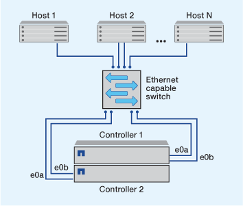

= Manières de configurer les hôtes SAN iSCSI
:allow-uri-read: 
:icons: font
:imagesdir: ../media/

[role="lead"]
Vous devez configurer votre configuration iSCSI avec des paires haute disponibilité qui se connectent directement à vos hôtes SAN iSCSI ou qui se connectent à vos hôtes via un ou plusieurs commutateurs IP.

link:../concepts/high-availability-pairs-concept.html["Paires HA"] Sont définis comme nœuds de reporting pour les chemins Active/Optimized et Active/UnOptimized qui seront utilisés par les hôtes pour accéder aux LUN. Plusieurs hôtes, utilisant différents systèmes d'exploitation, tels que Windows, Linux ou UNIX, peuvent accéder au stockage en même temps.  Les hôtes nécessitent qu'une solution de chemins d'accès multiples prise en charge qui prend en charge ALUA soit installée et configurée. Les systèmes d'exploitation et les solutions de chemins d'accès multiples pris en charge peuvent être vérifiés sur le link:https://mysupport.netapp.com/matrix["Matrice d'interopérabilité NetApp"^].

Dans une configuration multi-réseau, deux ou plusieurs commutateurs connectent les hôtes au système de stockage.  Les configurations multi-réseau sont recommandées car elles sont entièrement redondantes.  Dans une configuration à réseau unique, un commutateur connecte les hôtes au système de stockage.  Les configurations à un seul réseau ne sont pas entièrement redondantes.

[NOTE]
====
link:../system-admin/single-node-clusters.html["Configurations à un seul nœud"] ne sont pas recommandées, car elles n'offrent pas la redondance nécessaire à la prise en charge de la tolérance aux pannes et de la continuité de l'activité.

====
.Informations associées
* Découvrez comment link:../san-admin/selective-lun-map-concept.html#determine-whether-slm-is-enabled-on-a-lun-map["Mappage de LUN sélectif (SLM)"] Limite les chemins utilisés pour accéder aux LUN appartenant à une paire HA.
* Découvrez link:../san-admin/manage-lifs-all-san-protocols-concept.html["LIF SAN"].
* Découvrez le link:../san-config/benefits-vlans-iscsi-concept.html["Avantages des VLAN dans iSCSI"].

== Configurations iSCSI multi-réseau

Dans les configurations de paires haute disponibilité à plusieurs réseaux, au moins deux commutateurs connectent la paire haute disponibilité à un ou plusieurs hôtes. Étant donné qu'il y a plusieurs commutateurs, cette configuration est totalement redondante.

image::../media/scrn-en-drw-iscsi-dual.png[La configuration de paires haute disponibilité multi-réseau]

== Configurations iSCSI à réseau unique

Dans les configurations de paires haute disponibilité à réseau unique, un switch connecte la paire haute disponibilité à un ou plusieurs hôtes. Comme il y a un seul commutateur, cette configuration n'est pas entièrement redondante.

== Configuration iSCSI à connexion directe

Dans une configuration en attachement direct, un ou plusieurs hôtes sont directement connectés aux contrôleurs.

image::../media/dual-host-dual-controller.png[Configuration directe de l'équipement]
