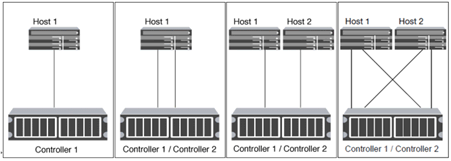

= Façons de configurer des hôtes SAN iSCSI avec des paires haute disponibilité
:allow-uri-read: 
:icons: font
:imagesdir: ../media/

[role="lead"]
Vous pouvez configurer les hôtes SAN iSCSI pour qu'ils se connectent à des configurations à double nœud ou multinœud à l'aide d'un ou de plusieurs commutateurs IP. Vous devez déterminer si vous voulez une configuration à un seul commutateur qui n'est pas entièrement redondante ou une configuration à plusieurs commutateurs entièrement redondante.

Vous pouvez configurer des hôtes SAN iSCSI avec des contrôleurs uniques et des paires haute disponibilité sur des environnements à attachement direct, à un seul réseau ou à plusieurs réseaux. Les paires HAUTE DISPONIBILITÉ peuvent avoir plusieurs connexions iSCSI à chaque commutateur, mais un logiciel de chemins d'accès multiples prenant en charge ALUA est nécessaire sur chaque hôte. Si il y a plusieurs hôtes, vous pouvez configurer chaque hôte avec un autre système d'exploitation en consultant la matrice d'interopérabilité NetApp.

https://mysupport.netapp.com/matrix["Matrice d'interopérabilité NetApp"^]

== Fixation directe

Dans une configuration en attachement direct, un ou plusieurs hôtes sont directement connectés aux contrôleurs.

== Paires haute disponibilité d'un seul réseau

Dans les configurations de paires haute disponibilité à réseau unique, un switch connecte la paire haute disponibilité à un ou plusieurs hôtes. Comme il y a un seul commutateur, cette configuration n'est pas entièrement redondante.

image::../media/scrn-en-drw-iscsi-single.gif[asn en utilisant iscsi unique]

== Paires haute disponibilité multi-réseau

Dans les configurations de paires haute disponibilité à plusieurs réseaux, au moins deux commutateurs connectent la paire haute disponibilité à un ou plusieurs hôtes. Étant donné qu'il y a plusieurs commutateurs, cette configuration est totalement redondante.

image::../media/scrn-en-drw-iscsi-dual.gif[scrum en utilisant iscsi dual]
