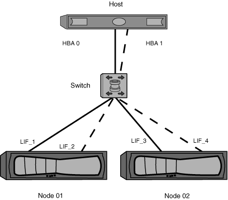

= Segmentation à structure unique
:allow-uri-read: 
:icons: font
:imagesdir: ../media/

[role="lead"]
Dans une configuration à structure unique, vous pouvez toujours connecter chaque initiateur hôte à chaque nœud de stockage. Vous avez besoin d'un logiciel de chemins d'accès multiples sur l'hôte pour gérer les chemins multiples. Chaque hôte doit avoir deux initiateurs pour les chemins d'accès multiples pour fournir la résilience dans la solution.

Chaque initiateur doit disposer d'au moins une LIF à partir de chaque nœud auquel celui-ci peut accéder. Le zoning doit permettre à au moins un chemin entre l'initiateur hôte et la paire haute disponibilité de nœuds dans le cluster pour fournir un chemin d'accès à la connectivité LUN. Cela signifie que chaque initiateur sur l'hôte peut ne disposer que d'une seule LIF cible par nœud dans sa configuration de zone. Si des chemins d'accès multiples sont nécessaires vers le même nœud ou vers plusieurs nœuds du cluster, chaque nœud aura plusieurs LIF par nœud dans sa configuration de zone. Cela permet à l'hôte d'accéder toujours à ses LUN en cas de défaillance d'un nœud ou si un volume contenant la LUN est déplacé vers un autre nœud. Il est également nécessaire de définir correctement les nœuds de reporting.

Les configurations à structure unique sont prises en charge, mais ne sont pas considérées comme hautement disponibles. La défaillance d'un seul composant peut entraîner la perte de l'accès aux données.

Dans la figure suivante, l'hôte a deux initiateurs et exécute un logiciel de chemins d'accès multiples. Il y a deux zones :

[NOTE]
====
la convention de nom utilisée dans cette figure ne constitue qu'une recommandation d'une convention de nom possible que vous pouvez utiliser pour votre solution ONTAP.

====
* Zone 1 : HBA 0, LIF_1 et LIF_3
* Zone 2 : HBA 1, LIF_2 et LIF_4

Si la configuration incluait plus de nœuds, les LIF pour les nœuds supplémentaires seraient incluses dans ces zones.

Dans cet exemple, vous pouvez aussi avoir les quatre LIF dans chaque zone. Dans ce cas, les zones seraient les suivantes :

* Zone 1 : HBA 0, LIF_1, LIF_2, LIF_3 et LIF_4
* Zone 2 : HBA 1, LIF_1, LIF_2, LIF_3 et LIF_4

[NOTE]
====
Le système d'exploitation hôte et le logiciel de chemins d'accès multiples doivent prendre en charge le nombre de chemins pris en charge qui sont utilisés pour accéder aux LUN sur les nœuds. Pour déterminer le nombre de chemins utilisés pour accéder aux LUN sur les nœuds, reportez-vous à la section limites de configuration SAN.

====
.Informations associées
https://["NetApp Hardware Universe"^]
