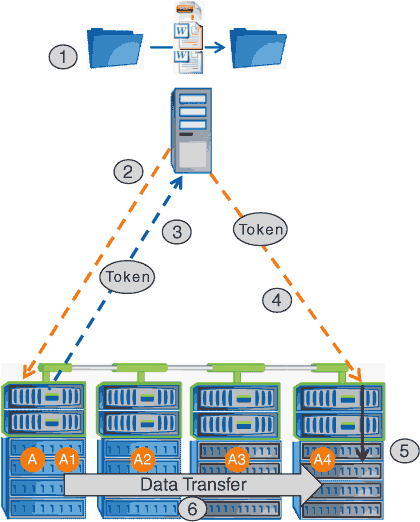

= Fonctionnement d'ODX
:allow-uri-read: 
:icons: font
:imagesdir: ../media/

[role="lead"]
L'allègement de la charge de copies (ODX) utilise un mécanisme basé sur des jetons pour la lecture et l'écriture des données dans et entre des serveurs CIFS compatibles avec ODX. Au lieu d'acheminer les données via l'hôte, le serveur CIFS envoie un petit jeton qui représente les données au client. Le client ODX présente ce token au serveur de destination, qui peut ensuite transférer les données représentées par ce token de la source vers la destination.

Lorsqu'un client ODX apprend que le serveur CIFS prend en charge ODX, il ouvre le fichier source et demande un jeton au serveur CIFS. Après l'ouverture du fichier de destination, le client utilise le jeton pour demander au serveur de copier les données directement de la source vers la destination.

[NOTE]
====
La source et la destination peuvent se trouver sur le même SVM (Storage Virtual machine) ou sur différents SVM, selon le cadre de l'opération de copie.

====
Ce token sert de représentation des données à un point dans le temps. Par exemple, lorsque vous copiez des données entre des emplacements de stockage, un token représentant un segment de données est renvoyé au client requérant, que le client copie vers la destination, ce qui élimine la nécessité de copier les données sous-jacentes via le client.

ONTAP prend en charge les jetons représentant 8 Mo de données. Des copies ODX de plus de 8 Mo sont effectuées à l'aide de plusieurs jetons, chaque jeton représentant 8 Mo de données.

La figure suivante décrit les étapes du processus de copie d'ODX :

. Un utilisateur copie ou déplace un fichier à l'aide de l'Explorateur Windows, d'une interface de ligne de commande ou dans le cadre d'une migration d'un serveur virtuel, ou une application crée des copies ou des déplacements de fichiers.
. Le client compatible ODX convertit automatiquement cette demande de transfert en requête d'ODX.
+
La demande ODX envoyée au serveur CIFS contient une demande de jeton.

. Si ODX est activé sur le serveur CIFS et que la connexion est via SMB 3.0, le serveur CIFS génère un jeton, qui est une représentation logique des données sur la source.
. Le client reçoit un jeton représentant les données et l'envoie avec la demande d'écriture au serveur CIFS de destination.
+
Il s'agit des seules données copiées sur le réseau de la source vers le client, puis du client vers la destination.

. Ce jeton est fourni au sous-système de stockage.
. La SVM effectue en interne la copie ou déplacement.
+
Si le fichier copié ou déplacé dépasse 8 Mo, plusieurs jetons sont nécessaires pour effectuer la copie. Les étapes 2 à 6 ont été effectuées selon les besoins pour compléter la copie.

[NOTE]
====
En cas de défaillance de la copie ODX déchargée, l'opération de copie ou de déplacement retourne aux lectures et écritures traditionnelles de la copie ou du déplacement. De même, si le serveur CIFS de destination ne prend pas en charge ODX ou ODX est désactivé, l'opération de copie ou de déplacement retourne aux opérations classiques de lecture et d'écriture pour la copie ou de déplacement.

====