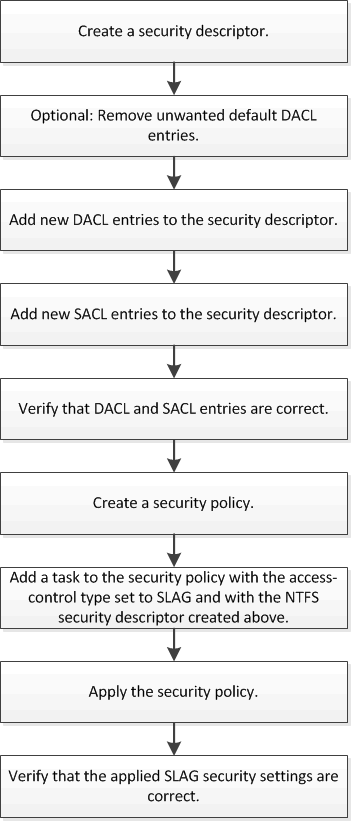

= Workflow de configuration de Storage-Level Access Guard
:allow-uri-read: 
:icons: font
:imagesdir: ../media/

[role="lead"]
Le workflow de configuration de Storage-Level Access Guard (SLAG) utilise les mêmes commandes CLI de ONTAP que celles que vous utilisez pour configurer les autorisations d'accès aux fichiers NTFS et les stratégies d'audit. Au lieu de configurer l'accès aux fichiers et aux répertoires sur une cible désignée, vous configurez LE SLAG sur le volume SVM (Storage Virtual machine) désigné.

xref:configure-storage-level-access-guard-task.adoc[Configuration de Storage-Level Access Guard]
