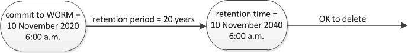

= Définissez l'aperçu de la durée de conservation
:allow-uri-read: 
:icons: font
:imagesdir: ../media/

[role="lead"]
Vous pouvez définir explicitement la durée de conservation d'un fichier ou utiliser la période de rétention par défaut pour le volume afin de définir la durée de conservation. Sauf si vous définissez explicitement la durée de conservation, SnapLock utilise la période de conservation par défaut pour calculer la durée de conservation.

== À propos de la période de conservation et de la durée de conservation

Le paramètre _rétention_période_ pour un fichier WORM spécifie la durée pendant laquelle le fichier doit être conservé après son activation à l'état WORM. Le _temps de rétention_ pour un fichier WORM est le temps après lequel le fichier n'a plus besoin d'être conservé. Une période de conservation de 20 ans pour un dossier engagé à l'état WORM le 10 novembre 2020 6 h 00, par exemple, entraînerait un temps de rétention de 10 novembre 2040 6 h 00

[NOTE]
====
Depuis ONTAP 9.10.1, vous pouvez définir une durée de conservation allant jusqu'au 26 octobre 3058 et une période de conservation pouvant aller jusqu'à 100 ans. Lorsque vous prolongez les dates de conservation, les anciennes règles sont automatiquement converties. Dans ONTAP 9.9.1 et versions antérieures, sauf si vous avez défini la période de conservation par défaut sur infinie, la durée maximale de conservation prise en charge est de janvier 19 2071 (GMT).

====

== Considérations importantes relatives à la réplication

Lorsque vous définissez une relation SnapMirror avec un volume source SnapLock à une date de conservation postérieure au 19 janvier 2071 (GMT), le cluster de destination doit exécuter ONTAP 9.10.1 ou version ultérieure, sinon le transfert SnapMirror échoue.

== Considérations importantes concernant la restauration

ONTAP vous empêche de restaurer un cluster depuis ONTAP 9.10.1 vers une version antérieure de ONTAP lorsqu'il y a des fichiers avec une période de conservation postérieure à « janvier 19, 2071 8:44:07 ».

== Compréhension des périodes de conservation par défaut

Un volume SnapLock Compliance ou Enterprise a quatre périodes de conservation :

* Durée de conservation minimale (`min`), avec une valeur par défaut de 0
* Durée de conservation maximale (`max`), avec une valeur par défaut de 30 ans
* Période de rétention par défaut, avec une valeur par défaut égale à `min` Pour le mode conformité et le mode entreprise à partir de ONTAP 9.10.1. Dans les versions ONTAP antérieures à ONTAP 9.10.1, la période de conservation par défaut dépend du mode :
+
** Pour le mode conformité, la valeur par défaut est égale à `max`.
** Pour le mode entreprise, la valeur par défaut est égale à `min`.

* Période de conservation non spécifiée.
+
Depuis ONTAP 9.8, vous pouvez définir la période de conservation des fichiers d'un volume sur `unspecified`, pour activer le fichier à conserver jusqu'à ce que vous ayez défini une durée de conservation absolue. Vous pouvez définir un fichier avec un temps de conservation absolu sur une rétention non spécifiée et revenir à une conservation absolue tant que la nouvelle durée de conservation absolue est postérieure à la durée absolue que vous avez définie précédemment.

Ainsi, si vous ne définissez pas explicitement la durée de rétention avant de valider un fichier en mode conformité à l'état WORM et que vous ne modifiez pas les valeurs par défaut, le fichier sera conservé pendant 30 ans. De même, si vous ne définissez pas explicitement la durée de rétention avant de valider un fichier Enterprise-mode à l'état WORM et que vous ne modifiez pas les valeurs par défaut, le fichier sera conservé pendant 0 ans, ou, de manière efficace, pas du tout.
