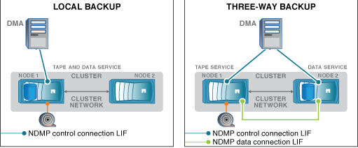

= Quelles sont les informations d'affinité
:allow-uri-read: 
:icons: font
:imagesdir: ../media/

[role="lead"]
Avec l'application de sauvegarde orientée CAB, le serveur NDMP fournit des informations d'emplacement uniques sur les volumes et les lecteurs de bande. Avec ces informations d'affinité, l'application de sauvegarde peut effectuer une sauvegarde locale au lieu d'une sauvegarde à trois voies si un volume et un périphérique de bande partagent la même affinité.

Si la connexion de contrôle NDMP est établie sur une LIF de node-management, LIF de cluster management, Ou d'une LIF intercluster, l'application de sauvegarde peut utiliser les informations d'affinité pour déterminer si un volume et une unité de bande sont situés sur le même nœud, puis effectuer une opération de sauvegarde ou de restauration locale ou à trois voies. Si la connexion de contrôle NDMP est établie sur une LIF de données, l'application de sauvegarde effectue toujours une sauvegarde à trois voies.

== Sauvegarde NDMP locale et sauvegarde NDMP à trois voies

À l'aide des informations d'affinité concernant les volumes et les périphériques de bande, le DMA (application de sauvegarde) effectue une sauvegarde NDMP locale sur le volume et le périphérique de bande situés sur le nœud 1 du cluster. Si le volume passe du nœud 1 au nœud 2, les informations d'affinité concernant le volume et le périphérique de bande changent. Par conséquent, pour une sauvegarde ultérieure, le DMA effectue une opération de sauvegarde NDMP à trois voies. Cela assure la continuité de la stratégie de sauvegarde pour le volume, quel que soit le nœud vers lequel le volume est déplacé.

.Informations associées
xref:cluster-aware-backup-extension-concept.adoc[Rôle de l'extension Cluster Aware Backup]
