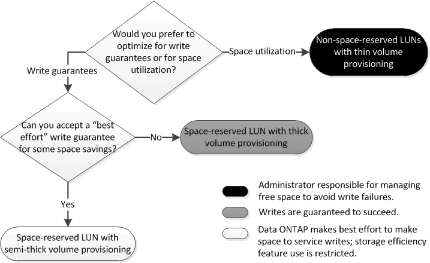

= Déterminez la combinaison de configuration de volume et de LUN adaptée à votre environnement
:allow-uri-read: 
:icons: font
:imagesdir: ../media/

[role="lead"]
En répondant à quelques questions de base sur votre environnement, vous pourrez déterminer la meilleure configuration de volumes FlexVol et de LUN pour votre environnement.

.Description de la tâche
Vous pouvez optimiser les configurations des LUN et des volumes pour optimiser l'utilisation du stockage ou pour garantir la sécurité de l'écriture. En fonction de vos besoins en matière d'utilisation du stockage et de votre capacité à surveiller et à assurer la capacité des stocks disponibles rapidement, vous devez déterminer le volume FlexVol et les volumes LUN appropriés à votre installation.

[NOTE]
====
Aucun volume n'est nécessaire pour chaque LUN.

====
.Étape
. Utilisez l'arbre de décision suivant pour déterminer la meilleure combinaison de configuration de volumes et de LUN pour votre environnement :
+

