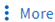

= Gérer les volumes
:allow-uri-read: 

[role="lead"]
Une fois que vous avez affiché une liste de volumes dans System Manager, vous pouvez effectuer différentes actions pour gérer les volumes.

.Étapes
. Dans System Manager, cliquez sur *stockage > volumes*.
+
La liste des volumes s'affiche.

. Vous pouvez effectuer les opérations suivantes :

[cols="25,75"]
|===

| Pour effectuer cette tâche... | Prenez ces mesures... 

 a| 
Ajouter un volume
 a| 
Cliquez sur image:../media/icon_add_blue_bg.gif["ajouter une icône"]. Voir link:../task_admin_add_a_volume.html["Ajouter un volume"].

 a| 
Gestion de plusieurs volumes
 a| 
Cochez les cases en regard des volumes.

* Cliquez sur image:../media/icon_delete_with_can_white_bg.gif["icône supprimer"] pour supprimer les volumes sélectionnés.
* Cliquez sur image:../media/icon_protect.gif["icône protéger"] pour affecter une stratégie de protection aux volumes sélectionnés.
* Cliquez sur  pour sélectionner l'une des actions suivantes à effectuer pour tous les volumes sélectionnés :
+
** Activer un quota
** Mettez-le hors ligne
** Déplacer
** Afficher les volumes supprimés

 a| 
Gérer un seul volume
 a| 
En regard du volume, cliquez sur image:../media/icon_kabob.gif["icône kebab"], puis sélectionnez l'une des actions suivantes à effectuer :

* Modifier
* Redimensionner (à partir de ONTAP 9.10.1, et uniquement pour les volumes en ligne et les volumes DP FlexVol)
* Supprimer
* Clonage
* Mise hors ligne (ou mise en ligne)
* Activer un quota (ou désactiver un quota)
* Modifier la politique d'exportation
* Modifier le chemin de montage
* Déplacer
* Modifier les paramètres de Tier cloud
* Protéger

|===