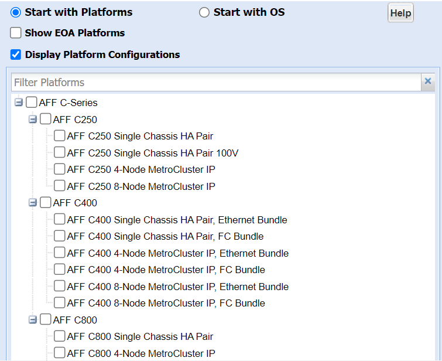

= Limites de stockage
:allow-uri-read: 
:icons: font
:imagesdir: ../media/

[role="lead"]
Lors de la planification et de la gestion de votre architecture de stockage, vous devez tenir compte de limites liées aux objets de stockage.

Les limites dépendent souvent de la plateforme. Reportez-vous à la link:https://hwu.netapp.com/["NetApp Hardware Universe"^] pour connaître les limites de votre configuration spécifique. Voir <<hwu>> Pour obtenir des instructions sur l'identification des informations appropriées pour votre configuration ONTAP.

Les limites sont répertoriées dans les sections suivantes :

* <<vollimits>>
* <<flexclone>>

Les limites de stockage pour Cloud Volumes ONTAP sont documentées dans le link:https://docs.netapp.com/us-en/cloud-volumes-ontap/["Notes de version de Cloud Volumes ONTAP"^].

== Limites de volume

[cols="4*"]
|===
| Objet de stockage | Limite | Stockage natif | Les baies de stockage 

 a| 
*LUN de baie*
 a| 
Taille minimale pour le volume racine^1^
 a| 
S/O
 a| 
Dépend du modèle

 a| 
*Fichiers*
 a| 
Taille maximale
 a| 
Dépendant de la version^2^
 a| 
Dépendant de la version^2^

 a| 
Maximum par volume^4^
 a| 
Selon la taille du volume, jusqu'à 2 milliards
 a| 
Selon la taille du volume, jusqu'à 2 milliards

 a| 
*Volumes FlexClone*
 a| 
Profondeur de clone hiérarchique^5^
 a| 
499
 a| 
499

 a| 
*Volumes FlexVol*
 a| 
Maximum par nœud^1^
 a| 
Dépend du modèle
 a| 
Dépend du modèle

 a| 
Maximum par nœud par SVM^6^
 a| 
Dépend du modèle
 a| 
Dépend du modèle

 a| 
Taille minimale
 a| 
20 MO
 a| 
20 MO

 a| 
Taille maximale^1^
 a| 
Dépend du modèle
 a| 
Dépend du modèle

 a| 
*Volumes FlexVol pour les charges de travail primaires*
 a| 
Maximum par nœud^3^
 a| 
Dépend du modèle
 a| 
Dépend du modèle

 a| 
*Volumes root FlexVol*
 a| 
Taille minimale^1^
 a| 
Dépend du modèle
 a| 
Dépend du modèle

 a| 
*LUN*
 a| 
Maximum par nœud^6^
 a| 
Dépend du modèle
 a| 
Dépend du modèle

 a| 
Maximum par cluster^6^
 a| 
Dépend du modèle
 a| 
Dépend du modèle

 a| 
Maximum par volume^6^
 a| 
Dépend du modèle
 a| 
Dépend du modèle

 a| 
Taille maximale
 a| 
Dépendant de la version^2^
 a| 
Dépendant de la version^2^

 a| 
*Qtrees*
 a| 
Maximum par volume FlexVol
 a| 
4,995
 a| 
4,995

 a| 
*Copies snapshot*
 a| 
Maximum par volume^7^
 a| 
255/1023
 a| 
255/1023

 a| 
*Volumes*
 a| 
Maximum par cluster pour NAS
 a| 
12,000
 a| 
12,000

 a| 
Maximum par cluster avec les protocoles SAN configurés
 a| 
Dépend du modèle
 a| 
Dépend du modèle

|===
*Notes:*

. Dans ONTAP 9.3 et versions antérieures, un volume peut contenir jusqu'à 255 copies Snapshot. Dans ONTAP 9.4 et versions ultérieures, un volume peut contenir jusqu'à 1023 copies Snapshot.
. À partir de ONTAP 9.12.1P2, la limite est de 128 To. Dans ONTAP 9.11.1 et les versions antérieures, la limite est de 16 To.
. À partir de ONTAP 9.7, le nombre maximal de volumes FlexVol pris en charge sur les plateformes AFF avec au moins 128 Go de mémoire est passé à 2,500 volumes FlexVol par nœud.
+
Pour obtenir des informations spécifiques à la plate-forme et pour obtenir les dernières informations sur la prise en charge, reportez-vous à la section https://hwu.netapp.com/["Hardware Universe"^].

. 2 milliards = 2 × 10^9^.
. Profondeur maximale d'une hiérarchie imbriqué des volumes FlexClone pouvant être créés à partir d'un seul volume FlexVol.
. Cette limite s'applique uniquement aux environnements SAN.
+
link:../san-config/index.html["Configuration DE SAN"]

. Cette limite peut être utilisée lors d'un déploiement en cascade SnapMirror.

== Limites des fichiers FlexClone et des LUN FlexClone

[cols="3*"]
|===
| Limite | Stockage natif | Les baies de stockage 

 a| 
**Maximum par fichier ou LUN**^1^
 a| 
32,767
 a| 
32,767

 a| 
*Données totales partagées maximales par volume FlexVol*
 a| 
640 TO
 a| 
640 TO

|===
*Remarque :*

. Si vous essayez de créer plus de 32,767 clones, ONTAP crée automatiquement une nouvelle copie physique du fichier ou de la LUN parent.
+
Cette limite peut être inférieure pour les volumes FlexVol qui utilisent la déduplication.

== Naviguer dans NetApp Hardware Universe

Pour trouver des limites spécifiques à la plate-forme et dépendantes du modèle, reportez-vous au link:https://hwu.netapp.com/["NetApp Hardware Universe"^].

.Étapes
. Dans le menu déroulant **produits**, sélectionnez votre configuration matérielle.
+
image::../media/hardware-universe-products.png[Menu des produits Hardware Universe]

. Sélectionnez votre plate-forme.
+

. Sélectionnez la version appropriée de ONTAP, puis **Afficher les résultats**.
+

.Informations associées
https://www.netapp.com/cloud-services/cloud-manager/documentation/["Recherchez les notes de version de votre version de Cloud Volumes ONTAP"]
