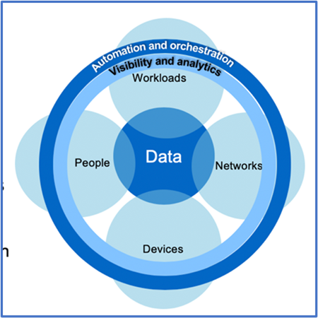

= Concevez une approche « zéro confiance » centrée sur les données avec ONTAP
:allow-uri-read: 
:icons: font
:imagesdir: ../media/

[role="lead"]
Un réseau « zéro confiance » est défini par une approche centrée sur les données dans laquelle les contrôles de sécurité doivent être aussi proches que possible des données. Les fonctionnalités de ONTAP, associées à l'écosystème de partenaires NetApp FPolicy, peuvent fournir les contrôles nécessaires au modèle « zéro confiance » centré sur les données.

ONTAP est le logiciel de gestion des données riche en fonctions de sécurité de NetApp, et le moteur « zéro confiance » FPolicy est une fonctionnalité ONTAP de pointe qui offre une interface de notification d'événements granulaire et basée sur des fichiers. Les partenaires NetApp FPolicy peuvent utiliser cette interface pour obtenir un niveau d'éclairage plus élevé de l'accès aux données dans ONTAP.

== Concevez un MCAP « zéro confiance » centré sur les données

Pour concevoir un MCAP Zero Trust axé sur les données, procédez comme suit :

. Identifiez l'emplacement de toutes les données de l'entreprise.
. Classez vos données.
. Supprimez en toute sécurité les données dont vous n'avez plus besoin.
. Comprendre quels rôles doivent avoir accès aux classifications de données.
. Appliquez le principe du privilège minimum pour appliquer les contrôles d'accès.
. Utilisez l'authentification multifacteur pour l'accès administratif et l'accès aux données.
. Utilisez le chiffrement pour les données au repos et en transit.
. Contrôlez et consignez tous les accès.
. Alertez les accès suspects ou les comportements à adopter.

=== Identifiez l'emplacement de toutes les données de l'entreprise

La fonctionnalité FPolicy de ONTAP associée à l'écosystème de partenaires Alliance NetApp de FPolicy vous permet d'identifier l'emplacement des données de votre entreprise et les personnes qui y ont accès. Cette opération est effectuée à l'aide d'une analyse comportementale des utilisateurs qui identifie si les modèles d'accès aux données sont valides. Pour plus d'informations sur l'analyse comportementale des utilisateurs, reportez-vous à la section contrôle et journalisation de tous les accès. Si vous ne comprenez pas où se trouvent vos données et qui y a accès, l'analyse comportementale des utilisateurs peut fournir une base pour établir une classification et une politique à partir d'observations empiriques.

=== Classez vos données

Dans la terminologie du modèle zéro confiance, la classification des données implique l'identification des données toxiques. Les données toxiques sont des données sensibles qui ne sont pas destinées à être exposées à l'extérieur d'une organisation. La divulgation de données toxiques peut contrevenir aux règlements et nuire à la réputation d'une entreprise. En termes de conformité réglementaire, les données toxiques incluent les données de titulaire de carte pour l' https://www.netapp.com/us/media/tr-4401.pdf["Norme de sécurité de l'industrie des cartes de paiement (PCI-DSS)"^], les données personnelles pour l' UE https://www.netapp.com/us/info/gdpr.aspx["Règlement général sur la protection des données (RGPD)"^]ou les données de santé pour l' https://www.hhs.gov/hipaa/for-professionals/privacy/laws-regulations/index.html["Loi américaine sur la transférabilité et la responsabilité en matière d'assurance maladie (HIPAA)"^]. Utilisez NetApp https://bluexp.netapp.com/netapp-cloud-data-sense["Classification BlueXP"^] (anciennement Cloud Data Sense), un kit d'outils piloté par l'IA, pour analyser, analyser et catégoriser automatiquement vos données.

=== Supprimez les données dont vous n'avez plus besoin en toute sécurité

Une fois les données de votre entreprise classifiées, vous pouvez découvrir que certaines de vos données ne sont plus nécessaires ou pertinentes pour le fonctionnement de votre entreprise. La conservation de données inutiles est une responsabilité et ces données doivent être supprimées. Pour obtenir un mécanisme avancé d'effacement cryptographique des données, consultez la description de la suppression sécurisée dans le chiffrement des données au repos.

=== Comprendre quels rôles doivent avoir accès aux classifications de données et appliquer le principe du privilège minimum pour appliquer les contrôles d'accès

Mapper l'accès aux données sensibles et appliquer le principe du privilège minimum implique de donner aux personnes de votre entreprise l'accès aux seules données requises pour accomplir leur travail. Ce processus implique le contrôle d'accès basé sur les rôles (https://docs.netapp.com/us-en/ontap/authentication/index.html["RBAC"^]), qui s'applique à l'accès aux données et à l'accès administratif.

Avec ONTAP, un SVM (Storage Virtual machine) peut être utilisé pour segmenter l'accès aux données de l'entreprise par les locataires au sein d'un cluster ONTAP. Le RBAC peut être appliqué à l'accès aux données ainsi qu'à l'accès administratif à la SVM. Le RBAC peut également être appliqué au niveau administratif du cluster.

En plus de RBAC, vous pouvez utiliser ONTAP link:../multi-admin-verify/index.html["vérification multiadministrateur"] (MAV) pour demander à un ou plusieurs administrateurs d'approuver des commandes telles que `volume delete` ou `volume snapshot delete`. Une fois MAV activé, la modification ou la désactivation de MAV nécessite l'approbation de l'administrateur MAV.

ONTAP est une autre façon de protéger les copies Snapshot link:../snaplock/snapshot-lock-concept.html["Verrouillage des copies Snapshot"]. Le verrouillage des copies Snapshot est une fonctionnalité SnapLock qui permet de rendre les copies Snapshot indélébiles, manuellement ou automatiquement, avec une période de conservation définie sur la règle de copie Snapshot du volume. Le verrouillage des copies Snapshot est également appelé verrouillage inviolable des copies Snapshot. L'objectif du verrouillage des copies Snapshot est d'empêcher les administrateurs peu scrupuleux ou non approuvés de supprimer les copies Snapshot sur les systèmes ONTAP primaires et secondaires. Il est possible d'effectuer une restauration rapide des copies Snapshot verrouillées sur des systèmes primaires afin de restaurer les volumes corrompus par des ransomwares.

=== Utilisez l'authentification multifacteur pour l'accès administratif et l'accès aux données

Outre le RBAC d'administration de cluster, https://www.netapp.com/us/media/tr-4647.pdf["Authentification multifacteur (MFA)"^] peut être déployé pour l'accès administratif web ONTAP et l'accès à la ligne de commande SSH (Secure Shell). L'authentification multifacteur en matière d'accès administratif est obligatoire pour les organisations du secteur public américain ou celles qui doivent suivre la norme PCI-DSS. L'authentification multifacteur empêche un attaquant de compromettre un compte en utilisant uniquement un nom d'utilisateur et un mot de passe. L'authentification MFA nécessite au moins deux facteurs indépendants. Un exemple d'authentification à deux facteurs est quelque chose qu'un utilisateur possède, comme une clé privée, et quelque chose qu'un utilisateur sait, comme un mot de passe. L'accès administratif Web à ONTAP System Manager ou à ActiveIQ Unified Manager est activé par le langage SAML (Security assertion Markup Language) 2.0. L'accès en ligne de commande SSH utilise une authentification à deux facteurs chaînée avec une clé publique et un mot de passe.

Vous pouvez contrôler l'accès des utilisateurs et des machines via des API dotées des fonctionnalités de gestion des identités et des accès de ONTAP :

* Utilisateur :
+
** *Authentification et autorisation.* Grâce aux fonctionnalités de protocole NAS pour SMB et NFS.
** *Vérification.* Syslog d'accès et d'événements. Une journalisation d'audit détaillée du protocole CIFS pour tester les règles d'authentification et d'autorisation. Audit précis et granulaire de l'accès NAS détaillé dans FPolicy au niveau des fichiers.

* Périphérique :
+
** *Authentification.* Authentification basée sur certificat pour l'accès à l'API.
** *Autorisation.* Contrôle d'accès basé sur des rôles (RBAC) par défaut ou personnalisé.
** *Vérification.* Syslog de toutes les actions entreprises.

=== Utilisez le chiffrement pour les données au repos et en transit

==== Chiffrement des données au repos

Chaque jour, lorsqu'une entreprise réutilise des disques, renvoie des disques défectueux ou effectue des mises à niveau vers des disques de plus grande capacité, elle doit satisfaire de nouvelles exigences afin de réduire les risques liés aux systèmes de stockage et les écarts d'infrastructure. En tant qu'administrateurs et opérateurs de ressources de données, les ingénieurs du stockage doivent gérer et maintenir les données en toute sécurité tout au long de leur cycle de vie. https://www.netapp.com/us/media/ds-3898.pdf["Chiffrement de stockage NetApp (NSE) ;#44 ; NetApp Volume Encryption (NVE) ;#44 ; et chiffrement d'agrégat NetApp"^] vous aider à chiffrer toutes vos données au repos en permanence, qu'elles soient toxiques ou non, et sans affecter les opérations quotidiennes. https://www.netapp.com/us/media/ds-3213-en.pdf["NSE"^] Est une solution matérielle ONTAP link:../encryption-at-rest/index.html["données au repos"] qui utilise des disques auto-cryptés conformes à la norme FIPS 140-2 de niveau 2. https://www.netapp.com/us/media/ds-3899.pdf["NVE et NAE"^] Sont une solution logicielle ONTAP link:../encryption-at-rest/index.html["données au repos"] qui utilise le https://csrc.nist.gov/projects/cryptographic-module-validation-program/certificate/4144["Module cryptographique NetApp conforme à la norme FIPS 140-2 de niveau 1"^]. Avec NVE et NAE, vous pouvez utiliser des disques durs ou des disques SSD pour le chiffrement des données au repos. De plus, les disques NSE peuvent être utilisés pour fournir une solution de chiffrement à plusieurs couches native qui assure la redondance du chiffrement et une sécurité supplémentaire. Si l'une des couches est rompue, la seconde couche sécurise toujours les données. Ces fonctionnalités font de ONTAP une solution bien positionnée pour https://www.netapp.com/us/media/sb-3952.pdf["chiffrement prêt pour le quantum"^].

NVE propose également une fonctionnalité appelée https://blog.netapp.com/flash-memory-summit-award/["suppression sécurisée"^] qui supprime de manière cryptographique les données toxiques des fuites de données lorsque les fichiers sensibles sont écrits sur un volume non classifié.

Soit le link:../encryption-at-rest/support-storage-encryption-concept.html["Gestionnaire de clés intégré Onboard Key Manager (OKM)"], qui est le gestionnaire de clés intégré dans ONTAP, soit un https://mysupport.netapp.com/matrix/imt.jsp?components=69551;&solution=1156&isHWU&src=IMT["approuvée"^] tiers link:../encryption-at-rest/support-storage-encryption-concept.html["gestionnaires de clés externes"] peut être utilisé avec NSE et NVE pour stocker des clés en toute sécurité.

image::../media/zero-trust-two-layer-encryption-solution-aff-fas.png[Solution de chiffrement à deux couches pour diagramme de flux AFF et FAS]

Comme le montre la figure ci-dessus, le chiffrement matériel et logiciel peut être combiné. Cette fonctionnalité a permis à l' https://www.netapp.com/blog/netapp-ontap-CSfC-validation/["Validation de ONTAP dans les solutions commerciales de la NSA pour le programme classifié"^] de stocker des données les plus secrètes.

==== Chiffrement des données à la volée

Le chiffrement des données à la volée ONTAP protège l'accès aux données utilisateur et l'accès au plan de contrôle. L'accès aux données utilisateur peut être chiffré par chiffrement SMB 3.0 pour l'accès aux partages Microsoft CIFS ou par krb5P pour NFS Kerberos 5. L'accès aux données utilisateur peut également être chiffré avec link:../networking/ipsec-prepare.html["IPSec"] pour CIFS, NFS et iSCSI. L'accès au plan de contrôle est chiffré avec TLS (transport Layer Security). ONTAP fournit https://docs.netapp.com/us-en/ontap-cli//security-config-modify.html["FIPS"^] le mode de conformité pour l'accès au plan de contrôle, qui active les algorithmes approuvés FIPS et désactive les algorithmes non approuvés FIPS. La réplication des données est chiffrée avec link:../peering/enable-cluster-peering-encryption-existing-task.html["chiffrement des pairs de cluster"]. Cela assure le cryptage pour les technologies ONTAP SnapVault et SnapMirror.

=== Contrôlez et consignez tous les accès

Une fois les règles RBAC en place, vous devez déployer des fonctionnalités actives de surveillance, d'audit et d'alerte. Le moteur « zéro confiance » FPolicy de NetApp ONTAP, couplé au https://www.netapp.com/partners/partner-connect["Écosystème de partenaires NetApp FPolicy"^], fournit les contrôles nécessaires au modèle « zéro confiance » centré sur les données. NetApp ONTAP est un logiciel de gestion des données riche en fonctions de sécurité. Il link:../nas-audit/two-parts-fpolicy-solution-concept.html["FPolicy"] s'agit d'une fonctionnalité ONTAP de pointe qui offre une interface de notification d'événements granulaire basée sur des fichiers. Les partenaires NetApp FPolicy peuvent utiliser cette interface pour obtenir un niveau d'éclairage plus élevé de l'accès aux données dans ONTAP. La fonctionnalité FPolicy de ONTAP, associée à l'écosystème de partenaires Alliance NetApp de FPolicy, vous permet d'identifier l'emplacement et l'accès aux données de votre entreprise. Cette opération est effectuée à l'aide d'une analyse comportementale des utilisateurs qui identifie si les modèles d'accès aux données sont valides. L'analyse comportementale des utilisateurs peut être utilisée pour alerter l'utilisateur en cas d'accès aux données suspect ou aberrant qui ne correspond pas au modèle normal et, si nécessaire, prendre des mesures pour refuser l'accès.

Les partenaires FPolicy vont au-delà de l'analyse comportementale des utilisateurs et s'orientent vers le machine learning (ML) et l'intelligence artificielle (IA) pour assurer la fidélité des événements et réduire le nombre de faux positifs, voire de faux positifs. Tous les événements doivent être consignés sur un serveur syslog ou sur un système de gestion des informations et des événements de sécurité (SIEM) pouvant également utiliser le ML et l'IA.

image::../media/zero-trust-fpolicy-architecture.png[Diagramme de l'architecture FPolicy]

La solution Storage Workload Security de NetApp (anciennement appelée https://docs.netapp.com/us-en/cloudinsights/cs_intro.html["Cloud Secure"^]) utilise l'interface FPolicy et l'analytique comportementale des utilisateurs sur les systèmes de stockage ONTAP dans le cloud et sur site pour vous fournir des alertes en temps réel sur les comportements malveillants des utilisateurs. Storage Workload Security protège les données de l'entreprise contre les activités abusives ou les usurpations d'identité à l'aide de fonctionnalités avancées de machine learning et de détection des anomalies. Storage Workload Security : identifie les attaques par ransomware ou d'autres comportements malveillants, invoque les copies Snapshot et met en quarantaine les utilisateurs malveillants. Storage Workload Security dispose également d'une fonctionnalité d'analyse permettant de visualiser en détail les activités des utilisateurs et des entités. La sécurité des workloads de stockage fait partie de NetApp Cloud Insights.

Outre la sécurité des workloads de stockage, ONTAP dispose d'une fonctionnalité intégrée de détection des ransomwares appelée link:../anti-ransomware/index.html["Protection autonome contre les ransomwares"] ARP. ARP utilise le machine learning pour déterminer si une activité anormale sur les fichiers indique qu'une attaque par ransomware est en cours, puis appelle une copie Snapshot et une alerte aux administrateurs. Storage Workload Security s'intègre à ONTAP pour recevoir des événements ARP et fournit une couche supplémentaire d'analytique et de réponses automatiques.
